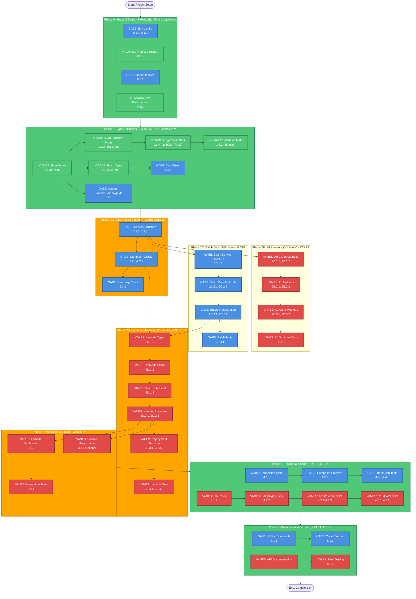

# Marin Dispatcher Integration - Workflow Diagram

**Document Version**: 1.1
**Created**: 2025-11-09
**Last Updated**: 2025-11-10
**Purpose**: Visual workflow diagram showing GABE and VANES parallel work paths

---

## Progress Summary

### ✅ Completed Tasks (7 tasks)
- ✅ **0.1.3**: Verify Project Structure (VANES)
- ✅ **0.2.2**: Setup Development Environment (VANES)
- ✅ **1.1.1**: Create Marin Dispatcher Base Types (GABE) - Commit: 5a1ca65
- ✅ **1.1.2**: Create Ad Structure Type Definitions (VANES) - Commit: 65147ea
- ✅ **1.1.3**: Create Batch Job Type Definitions (GABE) - Commit: 41fe9bf
- ✅ **1.1.4**: Create Type Validation Utilities (VANES) - Commit: f2cfb06, PR #16
- ✅ **1.3.2**: Create Type Validator Tests (VANES) - Commit: f2cfb06, PR #16

### 📊 Progress Statistics
- **Phase 0**: 2/4 tasks complete (50%)
- **Phase 1**: 5/7 tasks complete (71%)
- **Overall**: 7/100+ tasks complete (~7%)

### 🎯 Next Up
- **GABE**: Task 0.1.1 (Env Variables), Task 0.1.2 (Env Config), Task 0.2.1 (Dependencies)
- **VANES**: Task 1.2.2 (Verify IPlatformAPI Interface)

---

## Quick Reference: Parallel vs Sequential Work

```
✅ PARALLEL (Can work simultaneously):
   Phase 0: Setup
   Phase 1: Types (after 1.1.1)
   Phase 2B + Phase 2C: Ad Structure + Batch Jobs
   Phase 4: Testing
   Phase 5: Documentation

⚠️ SEQUENTIAL (Must follow order):
   Phase 2: Core Service (GABE only)
   Phase 2D: Lambda Integration (VANES only, waits for 2.2 & 2C.3)
   Phase 3: Integration (VANES only, waits for 2D.2)
```

---

## ASCII Workflow Diagram

```
┌─────────────────────────────────────────────────────────────────────────┐
│                         START: Project Setup                             │
└─────────────────────────────────────────────────────────────────────────┘
                                    │
                                    ▼
┌─────────────────────────────────────────────────────────────────────────┐
│  PHASE 0: Setup (1 hour) - ✅ PARALLEL - 50% Complete                 │
├─────────────────────────────────────────────────────────────────────────┤
│  GABE (Blue)              │  VANES (Red)                                │
│  ├─ 0.1.1: Env Variables  │  ├─ ✅ 0.1.3: Project Structure            │
│  ├─ 0.1.2: Env Config     │  └─ ✅ 0.2.2: Dev Environment              │
│  └─ 0.2.1: Dependencies   │                                             │
└─────────────────────────────────────────────────────────────────────────┘
                                    │
                                    ▼
┌─────────────────────────────────────────────────────────────────────────┐
│  PHASE 1: Type Definitions (2-3 hours) - ✅ PARALLEL - 71% Complete   │
├─────────────────────────────────────────────────────────────────────────┤
│  GABE (Blue)              │  VANES (Red)                                │
│  ├─ ✅ 1.1.1: Base Types  │  ├─ ✅ 1.1.2: Ad Structure (5a1ca65)       │
│  │   (5a1ca65)            │  ├─ ✅ 1.1.4: Validators (f2cfb06, PR#16)  │
│  ├─ ✅ 1.1.3: Batch Types │  └─ ✅ 1.3.2: Validator Tests (35 passed)  │
│  │   (41fe9bf)            │                                             │
│  ├─ 1.2.1: PlatformCampaignIds                                         │
│  └─ 1.3.1: Type Tests     │                                             │
└─────────────────────────────────────────────────────────────────────────┘
                                    │
                                    ▼
┌─────────────────────────────────────────────────────────────────────────┐
│  PHASE 2: Core Service (2-3 hours) - ⚠️ GABE ONLY (SEQUENTIAL)        │
├─────────────────────────────────────────────────────────────────────────┤
│  GABE (Blue)                                                             │
│  ├─ 2.1.1: Service Structure                                            │
│  ├─ 2.1.2: isAuthenticated                                              │
│  ├─ 2.2.1-2.2.7: Campaign CRUD                                          │
│  └─ 2.3.1: Campaign Tests                                                │
│                                                                          │
│  VANES: Waiting...                                                       │
└─────────────────────────────────────────────────────────────────────────┘
                                    │
                    ┌───────────────┴───────────────┐
                    │                               │
                    ▼                               ▼
┌───────────────────────────────────┐  ┌───────────────────────────────────┐
│  PHASE 2B: Ad Structure           │  │  PHASE 2C: Batch Jobs              │
│  (3-4 hours) - VANES              │  │  (4-5 hours) - GABE               │
│  ✅ PARALLEL                      │  │  ✅ PARALLEL                      │
├───────────────────────────────────┤  ├───────────────────────────────────┤
│  VANES (Red)                      │  │  GABE (Blue)                      │
│  ├─ 2B.1.1-2B.1.2: Ad Groups      │  │  ├─ 2C.1.1: Batch Structure       │
│  ├─ 2B.2.1-2B.2.2: Ads            │  │  ├─ 2C.2.1-2C.2.5: Batch Core     │
│  ├─ 2B.3.1-2B.3.2: Keywords       │  │  ├─ 2C.3.1-2C.3.2: Orchestration  │
│  └─ 2B.4.1: Ad Structure Tests   │  │  └─ 2C.4.1: Batch Tests           │
└───────────────────────────────────┘  └───────────────────────────────────┘
                    │                               │
                    └───────────────┬───────────────┘
                                    │
                                    ▼
┌─────────────────────────────────────────────────────────────────────────┐
│  PHASE 2D: Lambda Integration (2-3 hours) - ⚠️ VANES ONLY (SEQUENTIAL) │
│  ⚠️ WAITS FOR: Phase 2.2 (Campaign CRUD) + Phase 2C.3 (Orchestration)  │
├─────────────────────────────────────────────────────────────────────────┤
│  VANES (Red)                                                             │
│  ├─ 2D.1.1: Lambda Types                                                 │
│  ├─ 2D.1.2: Lambda Client                                                │
│  ├─ 2D.1.3: Batch Job Client (waits for 2C.3)                           │
│  ├─ 2D.2.1-2D.2.2: Handler Examples                                      │
│  ├─ 2D.3.1-2D.3.2: Deployment Structure                                  │
│  └─ 2D.4.1-2D.4.2: Lambda Tests                                          │
│                                                                          │
│  GABE: Waiting...                                                        │
└─────────────────────────────────────────────────────────────────────────┘
                                    │
                                    ▼
┌─────────────────────────────────────────────────────────────────────────┐
│  PHASE 3: Integration (30 min) - ⚠️ VANES ONLY (SEQUENTIAL)            │
│  ⚠️ WAITS FOR: Phase 2D.2 (Handler Examples)                            │
├─────────────────────────────────────────────────────────────────────────┤
│  VANES (Red)                                                             │
│  ├─ 3.1.1: Service Registration (Optional)                              │
│  ├─ 3.1.2: Lambda Verification                                           │
│  └─ 3.2.1: Integration Tests                                              │
│                                                                          │
│  GABE: Waiting...                                                        │
└─────────────────────────────────────────────────────────────────────────┘
                                    │
                                    ▼
┌─────────────────────────────────────────────────────────────────────────┐
│  PHASE 4: Testing (3-4 hours) - ✅ PARALLEL                             │
├─────────────────────────────────────────────────────────────────────────┤
│  GABE (Blue)              │  VANES (Red)                                │
│  ├─ 4.1.1: Connection     │  ├─ 4.1.2: Env Tests                       │
│  ├─ 4.2.1: Campaign Lifecycle│  ├─ 4.2.2: Campaign Query               │
│  └─ 4.4.1-4.4.3: Batch Tests│  ├─ 4.3.1-4.3.3: Ad Structure Tests      │
│                            │  └─ 4.5.1-4.5.2: REST API Tests            │
└─────────────────────────────────────────────────────────────────────────┘
                                    │
                                    ▼
┌─────────────────────────────────────────────────────────────────────────┐
│  PHASE 5: Documentation (1 hour) - ✅ PARALLEL                          │
├─────────────────────────────────────────────────────────────────────────┤
│  GABE (Blue)              │  VANES (Red)                                │
│  ├─ 5.1.1: JSDoc Comments │  ├─ 5.1.2: API Documentation                │
│  └─ 5.2.1: Code Cleanup   │  └─ 5.2.2: Final Testing                    │
└─────────────────────────────────────────────────────────────────────────┘
                                    │
                                    ▼
┌─────────────────────────────────────────────────────────────────────────┐
│                         END: Complete ✅                                 │
└─────────────────────────────────────────────────────────────────────────┘

Legend:
  ✅ = Can work in parallel
  ⚠️ = Must follow order (sequential)
  🔴 = Critical blocker
  Blue = GABE's tasks
  Red = VANES's tasks
```

---

## Mermaid Workflow Diagram



---

## Simplified Workflow Paths

### GABE's Path (Blue Track)
```
Phase 0: Setup (0/3 complete)
  ├─ 0.1.1: Env Variables
  ├─ 0.1.2: Env Config Module
  └─ 0.2.1: Dependencies

Phase 1: Types (3/4 complete - 75%)
  ├─ ✅ 1.1.1: Base Types (5a1ca65)
  ├─ ✅ 1.1.3: Batch Types (41fe9bf)
  ├─ 1.2.1: Update PlatformCampaignIds
  └─ 1.3.1: Type Tests

Phase 2: Core Service (SEQUENTIAL)
  ├─ 2.1.1: Service Structure
  ├─ 2.1.2: isAuthenticated
  ├─ 2.2.1-2.2.7: Campaign CRUD
  └─ 2.3.1: Campaign Tests

Phase 2C: Batch Jobs (PARALLEL with Phase 2B)
  ├─ 2C.1.1: Batch Service Structure
  ├─ 2C.2.1-2C.2.5: Batch Core Methods
  ├─ 2C.3.1-2C.3.2: Batch Orchestration
  └─ 2C.4.1: Batch Tests

Phase 4: Testing
  ├─ 4.1.1: Connection Tests
  ├─ 4.2.1: Campaign Lifecycle
  └─ 4.4.1-4.4.3: Batch Job Tests

Phase 5: Documentation
  ├─ 5.1.1: JSDoc Comments
  └─ 5.2.1: Code Cleanup
```

### VANES's Path (Red Track)
```
Phase 0: Setup (2/2 complete - 100% ✅)
  ├─ ✅ 0.1.3: Project Structure
  └─ ✅ 0.2.2: Dev Environment

Phase 1: Types (3/3 complete - 100% ✅)
  ├─ ✅ 1.1.2: Ad Structure Types (65147ea)
  ├─ ✅ 1.1.4: Type Validators (f2cfb06, PR#16)
  └─ ✅ 1.3.2: Validator Tests (35 tests passed)

Phase 2B: Ad Structure (PARALLEL with Phase 2C)
  ├─ 2B.1.1-2B.1.2: Ad Group Methods
  ├─ 2B.2.1-2B.2.2: Ad Methods
  ├─ 2B.3.1-2B.3.2: Keyword Methods
  └─ 2B.4.1: Ad Structure Tests

Phase 2D: Lambda Integration (SEQUENTIAL - waits for 2.2 & 2C.3)
  ├─ 2D.1.1: Lambda Types
  ├─ 2D.1.2: Lambda Client
  ├─ 2D.1.3: Batch Job Client
  ├─ 2D.2.1-2D.2.2: Handler Examples
  ├─ 2D.3.1-2D.3.2: Deployment Structure
  └─ 2D.4.1-2D.4.2: Lambda Tests

Phase 3: Integration (SEQUENTIAL - waits for 2D)
  ├─ 3.1.1: Service Registration (Optional)
  ├─ 3.1.2: Lambda Verification
  └─ 3.2.1: Integration Tests

Phase 4: Testing
  ├─ 4.1.2: Env Tests
  ├─ 4.2.2: Campaign Query
  ├─ 4.3.1-4.3.3: Ad Structure Tests
  └─ 4.5.1-4.5.2: REST API Tests

Phase 5: Documentation
  ├─ 5.1.2: API Documentation
  └─ 5.2.2: Final Testing
```

---

## Parallel Work Opportunities

### ✅ Can Work in Parallel

1. **Phase 0 (Setup)** - Fully parallel
   - GABE: Environment config, dependencies
   - VANES: Project structure, dev environment

2. **Phase 1 (Types)** - Parallel after Task 1.1.1
   - GABE: Base types (1.1.1) → Batch types (1.1.3), PlatformCampaignIds (1.2.1)
   - VANES: Ad structure types (1.1.2) → Type validators (1.1.4)
   - ⚠️ **BLOCKER**: VANES must wait for GABE's Task 1.1.1 (Base Types)

3. **Phase 2B (Ad Structure) + Phase 2C (Batch Jobs)** - Parallel
   - GABE: Batch job service (Phase 2C)
   - VANES: Ad structure methods (Phase 2B)
   - Both can start after Phase 2.1.1 (Service Structure)

4. **Phase 4 (Testing)** - Mostly parallel
   - GABE: Connection tests, campaign lifecycle, batch job tests
   - VANES: Env tests, campaign query, ad structure tests, REST API tests

5. **Phase 5 (Documentation)** - Fully parallel
   - GABE: JSDoc comments, code cleanup
   - VANES: API documentation, final testing

### ⚠️ Must Follow Order (Sequential)

1. **Phase 2 (Core Service)** - GABE only, sequential
   - 2.1.1 → 2.1.2 → 2.2.1-2.2.7 → 2.3.1
   - VANES waits for Phase 2.2 to complete

2. **Phase 2D (Lambda Integration)** - VANES only, sequential
   - Depends on: Phase 2.2 (Campaign CRUD) AND Phase 2C.3 (Batch Orchestration)
   - 2D.1.1 → 2D.1.2 → 2D.1.3 → 2D.2.1-2D.2.2 → 2D.3.1-2D.3.2 → 2D.4.1-2D.4.2

3. **Phase 3 (Integration)** - VANES only, sequential
   - Depends on: Phase 2D.2 (Handler Examples)
   - 3.1.1 → 3.1.2 → 3.2.1

---

## Critical Dependencies

### 🔴 Blockers

1. **✅ Task 1.1.1 (GABE: Base Types)** - COMPLETED (5a1ca65)
   - Blocks: VANES Task 1.1.2 (Ad Structure Types) - ✅ UNBLOCKED
   - Status: ✅ Complete - VANES can proceed

2. **Phase 2.2 (GABE: Campaign CRUD)**
   - Blocks: VANES Phase 2D (Lambda Integration)
   - Must complete before Lambda integration

3. **Phase 2C.3 (GABE: Batch Orchestration)**
   - Blocks: VANES Task 2D.1.3 (Batch Job Client)
   - Must complete before batch job Lambda client

4. **Phase 2D.2 (VANES: Handler Examples)**
   - Blocks: VANES Phase 3 (Integration)
   - Must complete before integration tests

### 🟡 Handoffs

1. **✅ Phase 1 → Phase 2** - COMPLETED
   - ✅ GABE handed off base types to VANES (5a1ca65)
   - ✅ VANES completed ad structure types (65147ea)
   - Status: Both completed type definitions - Ready for Phase 2

2. **Phase 2 → Phase 2B/2C**
   - GABE hands off service structure
   - Both can work in parallel on different features

3. **Phase 2C.3 → Phase 2D.1.3**
   - GABE hands off batch orchestration
   - VANES creates batch job Lambda client

4. **Phase 2D → Phase 3**
   - VANES hands off Lambda integration
   - VANES verifies integration

---

## Timeline Estimate

### Day 1 (8 hours)
- **Morning (4 hours)**
  - Phase 0: Setup (1 hour) - Parallel ✅
  - Phase 1: Types (2-3 hours) - Parallel after 1.1.1 ✅
- **Afternoon (4 hours)**
  - Phase 2: Core Service (2-3 hours) - GABE only ⚠️
  - Phase 2B/2C: Ad Structure + Batch Jobs (3-4 hours) - Parallel ✅

### Day 2 (8 hours)
- **Morning (4 hours)**
  - Phase 2D: Lambda Integration (2-3 hours) - VANES only ⚠️
  - Phase 3: Integration (30 min) - VANES only ⚠️
- **Afternoon (4 hours)**
  - Phase 4: Testing (3-4 hours) - Parallel ✅

### Day 3 (4-8 hours)
- **Morning (4 hours)**
  - Phase 5: Documentation (1 hour) - Parallel ✅
  - Final cleanup and validation

---

## Key Coordination Points

1. **Start of Day 1**: GABE completes Task 1.1.1 (Base Types) first
2. **Mid Day 1**: GABE completes Phase 2.1.1 (Service Structure) - unblocks Phase 2B/2C
3. **End of Day 1**: GABE completes Phase 2.2 (Campaign CRUD) - unblocks Phase 2D
4. **Start of Day 2**: GABE completes Phase 2C.3 (Batch Orchestration) - unblocks Phase 2D.1.3
5. **Mid Day 2**: VANES completes Phase 2D.2 (Handler Examples) - unblocks Phase 3

---

## Legend

- ✅ **Green**: Can work in parallel
- ⚠️ **Orange**: Must follow order (sequential)
- 🔴 **Red**: Critical blocker
- 🟡 **Yellow**: Handoff point
- **Blue boxes**: GABE's tasks
- **Red boxes**: VANES's tasks

---

**Last Updated**: 2025-11-10
**Status**: Workflow Diagram Updated with Progress ✅

### Recent Updates (2025-11-10)
- ✅ Marked 7 completed tasks with commit IDs
- ✅ Added Progress Summary section
- ✅ Updated ASCII and Mermaid diagrams with completion status
- ✅ Phase 0: 50% complete (2/4 tasks)
- ✅ Phase 1: 71% complete (5/7 tasks)
- ✅ Overall: ~7% complete (7/100+ tasks)

