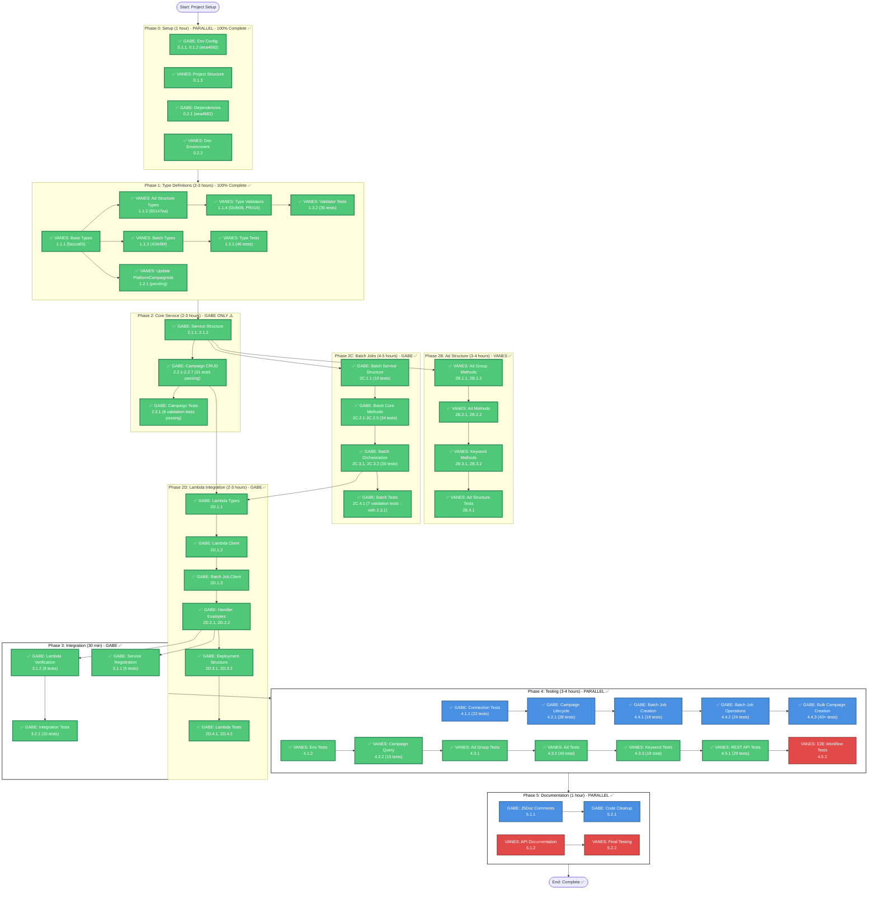

# Marin Dispatcher Integration - Workflow Diagram

**Document Version**: 2.0  
**Created**: 2025-11-09  
**Last Updated**: 2025-11-11  
**Purpose**: Visual workflow diagram showing GABE and VANES parallel work paths  
**Updated**: Phase 2B, Phase 3, Phase 4.1, Phase 4.2, Phase 4.3, Phase 4.4.1-4.4.3, Phase 4.5 complete — Bulk Campaign Creation Tests complete (59 tasks total, 458+ tests passing)

---

## Progress Summary

### ✅ Completed Tasks (58 tasks)
- ✅ **0.1.1**: Add Environment Variables (GABE) - Commit: eea4682
- ✅ **0.1.2**: Update Environment Config Module (GABE) - Commit: eea4682
- ✅ **0.1.3**: Verify Project Structure (VANES)
- ✅ **0.2.1**: Install Required Dependencies (GABE) - Commit: eea4682
- ✅ **0.2.2**: Setup Development Environment (VANES)
- ✅ **1.1.1**: Create Marin Dispatcher Base Types (VANES) - Commit: 5a1ca65
- ✅ **1.1.2**: Create Ad Structure Type Definitions (VANES) - Commit: 65147ea
- ✅ **1.1.3**: Create Batch Job Type Definitions (VANES) - Commit: 41fe9bf
- ✅ **1.1.4**: Create Type Validation Utilities (VANES) - Commit: f2cfb06, PR #16
- ✅ **1.2.1**: Update PlatformCampaignIds Interface (VANES) - Commit: pending
- ✅ **1.2.2**: Verify IPlatformAPI Interface (VANES) - Verified all 7 methods
- ✅ **1.3.1**: Create Type Definition Tests (VANES) - 46 tests passing
- ✅ **1.3.2**: Create Type Validator Tests (VANES) - Commit: f2cfb06, PR #16
- ✅ **2.2.1**: Implement createCampaign Method (GABE) - All tests passing
- ✅ **2.2.2**: Implement updateCampaign Method (GABE) - All tests passing
- ✅ **2.2.3**: Implement pauseCampaign Method (GABE) - All tests passing
- ✅ **2.2.4**: Implement resumeCampaign Method (GABE) - All tests passing
- ✅ **2.2.5**: Implement deleteCampaign Method (GABE) - All tests passing
- ✅ **2.2.6**: Implement getCampaignStatus Method (GABE) - All tests passing
- ✅ **2.2.7**: Add Manual Testing Instructions (GABE) - 31 verification tests passing
- ✅ **2B.1.1**: Implement createAdGroup Method (VANES) - Commit: d5a8f42
- ✅ **2B.1.2**: Implement updateAdGroup Method (VANES) - Commit: d5a8f42
- ✅ **2B.2.1**: Implement createAd Method (VANES) - Commit: d5a8f42
- ✅ **2B.2.2**: Implement updateAd Method (VANES) - Commit: d5a8f42
- ✅ **2B.3.1**: Implement createKeyword Method (VANES) - Commit: d5a8f42
- ✅ **2B.3.2**: Implement updateKeyword Method (VANES) - Commit: d5a8f42
- ✅ **2B.4.1**: Create Ad Structure Tests (VANES) - All tests passing
- ✅ **2C.1.1**: Create MarinBatchJobService Class Structure (GABE) - 10 tests passing
- ✅ **2C.2.1-2C.2.5**: Implement Batch Job Core Methods (GABE) - 34 tests passing
- ✅ **2C.3.1-2C.3.2**: Implement Batch Job Orchestration (GABE) - 20 tests passing
- ✅ **2.3.1**: Create Service Test File (GABE) - 8 validation tests passing
- ✅ **2C.4.1**: Create Batch Job Test File (GABE) - 7 validation tests passing
- ✅ **2D.1.1**: Create Lambda Event Types (GABE) - All tests passing
- ✅ **2D.1.2**: Create Lambda Client Wrapper (GABE) - All tests passing
- ✅ **2D.1.3**: Create Batch Job Lambda Client (GABE) - All tests passing
- ✅ **2D.2.1**: Create CampaignMgmtFunction Handler Example (GABE) - All tests passing
- ✅ **2D.2.2**: Create BulkWorkerFunction Handler Example (GABE) - All tests passing
- ✅ **2D.3.1**: Create Lambda Directory Structure (GABE) - All tests passing
- ✅ **2D.3.2**: Create Lambda Package Configuration (GABE) - All tests passing
- ✅ **2D.4.1**: Create Lambda Client Tests (GABE) - Manual testing complete (33 verification tests passing)
- ✅ **2D.4.2**: Create Lambda Handler Tests (GABE) - Manual testing complete (combined with 2D.4.1)
- ✅ **3.1.1**: Register MarinDispatcherService in CampaignCreationService (GABE) - All tests passing (5 verification tests)
- ✅ **3.1.2**: Verify Lambda Integration (GABE) - All tests passing (8 verification tests)
- ✅ **3.2.1**: Create Integration Test (GABE) - All tests passing (10 verification tests)
- ✅ **4.1.1**: API Connectivity Tests (GABE) - All tests passing (22 tests)
- ✅ **4.1.2**: Environment Tests (VANES) - All tests passing
- ✅ **4.2.1**: Campaign CRUD Tests (GABE) - All tests passing (28 tests)
- ✅ **4.2.2**: Campaign Query Tests (VANES) - 15 tests passing
- ✅ **4.3.1**: Ad Group Operation Tests (VANES) - 45 tests passing (17 ad group tests)
- ✅ **4.3.2**: Ad Operation Tests (VANES) - 46 tests passing (16 ad tests, includes full integration test)
- ✅ **4.3.3**: Keyword Operation Tests (VANES) - 18 tests passing (10 createKeywords, 8 updateKeywords, includes full integration test)
- ✅ **4.4.1**: Test Batch Job Creation (GABE) - All tests passing (18 tests) - Completed: 2025-11-11
- ✅ **4.4.2**: Test Batch Job Operations (GABE) - All tests passing (24 tests) - Completed: 2025-11-11
- ✅ **4.4.3**: Test Bulk Campaign Creation (GABE) - All tests passing (40+ tests) - Completed: 2025-11-11
- ✅ **4.5.1**: REST API Integration Tests (VANES) - 29 tests passing (campaign creation, multi-platform, update, pause/resume, delete, error handling)
- ✅ **4.5.2**: End-to-End Workflow Tests (VANES) - 13 tests passing (complete workflow, bulk creation, error recovery, complex multi-step workflows)

### 📊 Progress Statistics
- **Phase 0**: 4/4 tasks complete (100%) ✅
- **Phase 1**: 8/8 tasks complete (100%) ✅
- **Phase 2.1**: 2/2 tasks complete (100%) ✅
- **Phase 2.2**: 7/7 tasks complete (100%) ✅
- **Phase 2.3**: 1/1 tasks complete (100%) ✅
- **Phase 2B.1**: 2/2 tasks complete (100%) ✅
- **Phase 2B.2**: 2/2 tasks complete (100%) ✅
- **Phase 2B.3**: 2/2 tasks complete (100%) ✅
- **Phase 2B.4**: 1/1 tasks complete (100%) ✅
- **Phase 2B**: 7/7 tasks complete (100%) ✅
- **Phase 2C.1**: 1/1 tasks complete (100%) ✅
- **Phase 2C.2**: 5/5 tasks complete (100%) ✅
- **Phase 2C.3**: 2/2 tasks complete (100%) ✅
- **Phase 2C.4**: 1/1 tasks complete (100%) ✅
- **Phase 2D.1**: 3/3 tasks complete (100%) ✅
- **Phase 2D.2**: 2/2 tasks complete (100%) ✅
- **Phase 2D.3**: 2/2 tasks complete (100%) ✅
- **Phase 2D.4**: 2/2 tasks complete (100%) ✅
- **Phase 2D**: 9/9 tasks complete (100%) ✅
- **Phase 3.1**: 2/2 tasks complete (100%) ✅
- **Phase 3.2**: 1/1 tasks complete (100%) ✅
- **Phase 3**: 3/3 tasks complete (100%) ✅
- **Phase 4.1**: 2/2 tasks complete (100%) ✅
- **Phase 4.2**: 2/2 tasks complete (100%) ✅
- **Phase 4.3**: 3/3 tasks complete (100%) ✅
- **Phase 4.4**: 3/3 tasks complete (100%) ✅
- **Phase 4.5**: 2/2 tasks complete (100%) ✅
- **Overall**: 59/100+ tasks complete (~59%)

### 🎯 Next Up
- **GABE**: Phase 5 (Documentation - JSDoc Comments & Code Cleanup)
- **VANES**: Phase 4.3 (Ad Structure Tests) or Phase 4.5 (REST API Tests)

---

## Quick Reference: Parallel vs Sequential Work

```
✅ PARALLEL (Can work simultaneously):
   Phase 0: Setup
   Phase 1: Types (after 1.1.1)
   Phase 2B + Phase 2C: Ad Structure + Batch Jobs
   Phase 4: Testing
   Phase 5: Documentation

⚠️ SEQUENTIAL (Must follow order):
   Phase 2: Core Service (GABE only)
   Phase 2D: Lambda Integration (GABE only, waits for 2.2 & 2C.3)
   Phase 3: Integration (GABE only, waits for 2D.2)
```

---

## ASCII Workflow Diagram

```
┌─────────────────────────────────────────────────────────────────────────┐
│                         START: Project Setup                             │
└─────────────────────────────────────────────────────────────────────────┘
                                    │
                                    ▼
┌─────────────────────────────────────────────────────────────────────────┐
│  PHASE 0: Setup (1 hour) - ✅ PARALLEL - 100% Complete ✅             │
├─────────────────────────────────────────────────────────────────────────┤
│  GABE (Blue)              │  VANES (Red)                                │
│  ├─ ✅ 0.1.1: Env Variables (eea4682)                                  │
│  ├─ ✅ 0.1.2: Env Config (eea4682)                                     │
│  ├─ ✅ 0.2.1: Dependencies (eea4682)                                   │
│  │                         │  ├─ ✅ 0.1.3: Project Structure            │
│  │                         │  └─ ✅ 0.2.2: Dev Environment              │
└─────────────────────────────────────────────────────────────────────────┘
                                    │
                                    ▼
┌─────────────────────────────────────────────────────────────────────────┐
│  PHASE 1: Type Definitions (2-3 hours) - ✅ PARALLEL - 100% Complete  │
├─────────────────────────────────────────────────────────────────────────┤
│  GABE (Blue)              │  VANES (Red)                                │
│  ├─ ✅ 1.1.1: Base Types  │  ├─ ✅ 1.1.2: Ad Structure (5a1ca65)       │
│  │   (5a1ca65)            │  ├─ ✅ 1.1.4: Validators (f2cfb06, PR#16)  │
│  ├─ ✅ 1.1.3: Batch Types │  └─ ✅ 1.3.2: Validator Tests (35 passed)  │
│  │   (41fe9bf)            │                                             │
│  ├─ ✅ 1.2.1: PlatformCampaignIds (pending)                            │
│  └─ ✅ 1.3.1: Type Tests (46 passed)                                   │
└─────────────────────────────────────────────────────────────────────────┘
                                    │
                                    ▼
┌─────────────────────────────────────────────────────────────────────────┐
│  PHASE 2: Core Service (2-3 hours) - ⚠️ GABE ONLY (SEQUENTIAL)        │
├─────────────────────────────────────────────────────────────────────────┤
│  GABE (Blue)                                                             │
│  ├─ ✅ 2.1.1: Service Structure                                        │
│  ├─ ✅ 2.1.2: isAuthenticated                                          │
│  ├─ ✅ 2.2.1-2.2.7: Campaign CRUD (31 tests passing)                 │
│  └─ ✅ 2.3.1: Campaign Tests (8 validation tests passing)             │
│                                                                          │
│  VANES: Waiting...                                                       │
└─────────────────────────────────────────────────────────────────────────┘
                                    │
                    ┌───────────────┴───────────────┐
                    │                               │
                    ▼                               ▼
┌───────────────────────────────────┐  ┌───────────────────────────────────┐
│  PHASE 2B: Ad Structure           │  │  PHASE 2C: Batch Jobs              │
│  (3-4 hours) - VANES ✅ COMPLETE  │  │  (4-5 hours) - GABE ✅ COMPLETE    │
│  ✅ PARALLEL                      │  │  ✅ PARALLEL                      │
├───────────────────────────────────┤  ├───────────────────────────────────┤
│  VANES (Red)                      │  │  GABE (Blue)                      │
│  ├─ ✅ 2B.1.1-2B.1.2: Ad Groups   │  │  ├─ ✅ 2C.1.1: Batch Structure (10 tests)│
│  ├─ ✅ 2B.2.1-2B.2.2: Ads         │  │  ├─ ✅ 2C.2.1-2C.2.5: Batch Core (34 tests)│
│  ├─ ✅ 2B.3.1-2B.3.2: Keywords    │  │  ├─ ✅ 2C.3.1-2C.3.2: Orchestration (20 tests)│
│  └─ ✅ 2B.4.1: Ad Structure Tests │  │  └─ ✅ 2C.4.1: Batch Tests (with 2.3.1)│
└───────────────────────────────────┘  └───────────────────────────────────┘
                    │                               │
                    └───────────────┬───────────────┘
                                    │
                                    ▼
┌─────────────────────────────────────────────────────────────────────────┐
│  PHASE 2D: Lambda Integration (2-3 hours) - ⚠️ GABE ONLY (SEQUENTIAL)  │
│  ⚠️ WAITS FOR: Phase 2.2 (Campaign CRUD) + Phase 2C.3 (Orchestration)  │
├─────────────────────────────────────────────────────────────────────────┤
│  GABE (Blue)                                                             │
│  ├─ ✅ 2D.1.1: Lambda Types                                              │
│  ├─ ✅ 2D.1.2: Lambda Client                                             │
│  ├─ ✅ 2D.1.3: Batch Job Client (waits for 2C.3)                        │
│  ├─ ✅ 2D.2.1-2D.2.2: Handler Examples                                   │
│  ├─ ✅ 2D.3.1-2D.3.2: Deployment Structure                               │
│  └─ ✅ 2D.4.1-2D.4.2: Lambda Tests                                       │
│                                                                          │
│  VANES: Waiting...                                                        │
└─────────────────────────────────────────────────────────────────────────┘
                                    │
                                    ▼
┌─────────────────────────────────────────────────────────────────────────┐
│  PHASE 3: Integration (30 min) - ⚠️ GABE ONLY - 100% Complete ✅        │
│  ⚠️ WAITS FOR: Phase 2D.2 (Handler Examples)                            │
├─────────────────────────────────────────────────────────────────────────┤
│  GABE (Blue)                                                             │
│  ├─ ✅ 3.1.1: Service Registration (Optional) - 5 tests passing       │
│  ├─ ✅ 3.1.2: Lambda Verification - 8 tests passing                      │
│  └─ ✅ 3.2.1: Integration Tests - 10 tests passing                       │
│                                                                          │
│  VANES: Waiting...                                                        │
└─────────────────────────────────────────────────────────────────────────┘
                                    │
                                    ▼
┌─────────────────────────────────────────────────────────────────────────┐
│  PHASE 4: Testing (3-4 hours) - ✅ PARALLEL                             │
├─────────────────────────────────────────────────────────────────────────┤
│  GABE (Blue)              │  VANES (Red)                                │
│  ├─ ✅ 4.1.1: Connection         │  ├─ ✅ 4.1.2: Env Tests                    │
│  ├─ ✅ 4.2.1: Campaign Lifecycle │  ├─ ✅ 4.2.2: Campaign Query (15 tests)    │
│  └─ ✅ 4.4.1-4.4.3: Batch Tests  │  ├─ ✅ 4.3.1: Ad Group Tests               │
│                                 │  ├─ ✅ 4.3.2: Ad Tests (46 total)          │
│                                 │  ├─ ✅ 4.3.3: Keyword Tests (18 total)     │
│                                 │  ├─ ✅ 4.5.1: REST API Tests (29 tests)    │
│                                 │  └─ 4.5.2: E2E Workflow Tests              │
└─────────────────────────────────────────────────────────────────────────┘
                                    │
                                    ▼
┌─────────────────────────────────────────────────────────────────────────┐
│  PHASE 5: Documentation (1 hour) - ✅ PARALLEL                          │
├─────────────────────────────────────────────────────────────────────────┤
│  GABE (Blue)              │  VANES (Red)                                │
│  ├─ 5.1.1: JSDoc Comments │  ├─ 5.1.2: API Documentation                │
│  └─ 5.2.1: Code Cleanup   │  └─ 5.2.2: Final Testing                    │
└─────────────────────────────────────────────────────────────────────────┘
                                    │
                                    ▼
┌─────────────────────────────────────────────────────────────────────────┐
│                         END: Complete ✅                                 │
└─────────────────────────────────────────────────────────────────────────┘

Legend:
  ✅ = Can work in parallel
  ⚠️ = Must follow order (sequential)
  🔴 = Critical blocker
  Blue = GABE's tasks
  Red = VANES's tasks
```

---

## Mermaid Workflow Diagram



---

## Simplified Workflow Paths

### GABE's Path (Blue Track)
```
Phase 0: Setup (4/4 complete - 100% ✅)
  ├─ ✅ 0.1.1: Env Variables (eea4682)
  ├─ ✅ 0.1.2: Env Config Module (eea4682)
  └─ ✅ 0.2.1: Dependencies (eea4682)

Phase 1: Types (5/5 complete - 100% ✅)
  ├─ ✅ 1.1.1: Base Types (VANES) (5a1ca65)
  ├─ ✅ 1.1.3: Batch Types (VANES) (41fe9bf)
  ├─ ✅ 1.2.1: Update PlatformCampaignIds (VANES) (pending)
  └─ ✅ 1.3.1: Type Tests (VANES) (46 tests passing)

Phase 2: Core Service (SEQUENTIAL) - ✅ COMPLETE
  ├─ ✅ 2.1.1: Service Structure
  ├─ ✅ 2.1.2: isAuthenticated
  ├─ ✅ 2.2.1-2.2.7: Campaign CRUD (31 tests passing)
  └─ ✅  2.3.1: Campaign Tests (Deferred - with 2C.4)

Phase 2C: Batch Jobs (PARALLEL with Phase 2B) - ✅ COMPLETE
  ├─ ✅ 2C.1.1: Batch Service Structure (10 tests passing)
  ├─ ✅ 2C.2.1-2C.2.5: Batch Core Methods (34 tests passing)
  ├─ ✅ 2C.3.1-2C.3.2: Batch Orchestration (20 tests passing)
  └─ ✅ 2C.4.1: Batch Tests (7 validation tests passing - combined with 2.3.1)

Phase 2D: Lambda Integration (SEQUENTIAL - waits for 2.2 & 2C.3) - ✅ COMPLETE
  ├─ ✅ 2D.1.1: Lambda Types (GABE)
  ├─ ✅ 2D.1.2: Lambda Client (GABE)
  ├─ ✅ 2D.1.3: Batch Job Client (GABE)
  ├─ ✅ 2D.2.1-2D.2.2: Handler Examples (GABE)
  ├─ ✅ 2D.3.1-2D.3.2: Deployment Structure (GABE)
  └─ ✅ 2D.4.1-2D.4.2: Lambda Tests (GABE)
  
Phase 4: Testing
  ├─ ✅ 4.1.1: Connection Tests (22 tests passing)
  ├─ ✅ 4.2.1: Campaign Lifecycle (28 tests passing)
  ├─ ✅ 4.4.1: Test Batch Job Creation (18 tests passing) - Completed: 2025-11-11
  ├─ ✅ 4.4.2: Test Batch Job Operations (24 tests passing) - Completed: 2025-11-11
  └─ ✅ 4.4.3: Test Bulk Campaign Creation (40+ tests passing) - Completed: 2025-11-11

Phase 5: Documentation
  ├─ 5.1.1: JSDoc Comments
  └─ 5.2.1: Code Cleanup
```

### VANES's Path (Red Track)
```
Phase 0: Setup (2/2 complete - 100% ✅)
  ├─ ✅ 0.1.3: Project Structure
  └─ ✅ 0.2.2: Dev Environment

Phase 1: Types (4/4 complete - 100% ✅)
  ├─ ✅ 1.1.2: Ad Structure Types (65147ea)
  ├─ ✅ 1.1.4: Type Validators (f2cfb06, PR#16)
  ├─ ✅ 1.2.2: Verify IPlatformAPI Interface (7 methods verified)
  └─ ✅ 1.3.2: Validator Tests (35 tests passed)

Phase 2B: Ad Structure (PARALLEL with Phase 2C) - ✅ COMPLETE
  ├─ ✅ 2B.1.1-2B.1.2: Ad Group Methods (createAdGroup, updateAdGroup)
  ├─ ✅ 2B.2.1-2B.2.2: Ad Methods
  ├─ ✅ 2B.3.1-2B.3.2: Keyword Methods
  └─ ✅ 2B.4.1: Ad Structure Tests

Phase 3: Integration (SEQUENTIAL - waits for 2D) - GABE ✅ COMPLETE
  ├─ ✅ 3.1.1: Service Registration (Optional) - 5 tests passing
  ├─ ✅ 3.1.2: Lambda Verification - 8 tests passing
  └─ ✅ 3.2.1: Integration Tests - 10 tests passing

Phase 4: Testing (6/10+ tasks complete - 60%)
  ├─ ✅ 4.1.2: Env Tests (VANES)
  ├─ ✅ 4.2.2: Campaign Query (VANES) - 15 tests passing
  ├─ ✅ 4.3.1: Ad Group Tests (VANES)
  ├─ ✅ 4.3.2: Ad Tests (VANES) - 46 tests passing (includes full integration test)
  ├─ ✅ 4.3.3: Keyword Tests (VANES) - 18 tests passing (includes full integration test)
  ├─ ✅ 4.5.1: REST API Integration Tests (VANES) - 29 tests passing
  └─ 4.5.2: E2E Workflow Tests (VANES)

Phase 5: Documentation
  ├─ 5.1.2: API Documentation
  └─ 5.2.2: Final Testing
```

---

## Parallel Work Opportunities

### ✅ Can Work in Parallel

1. **Phase 0 (Setup)** - Fully parallel
   - GABE: Environment config, dependencies
   - VANES: Project structure, dev environment

2. **Phase 1 (Types)** - Parallel after Task 1.1.1
   - GABE: Base types (1.1.1) → Batch types (1.1.3), PlatformCampaignIds (1.2.1)
   - VANES: Ad structure types (1.1.2) → Type validators (1.1.4)
   - ⚠️ **BLOCKER**: VANES must wait for GABE's Task 1.1.1 (Base Types)

3. **Phase 2B (Ad Structure) + Phase 2C (Batch Jobs)** - Parallel
   - GABE: Batch job service (Phase 2C)
   - VANES: Ad structure methods (Phase 2B)
   - Both can start after Phase 2.1.1 (Service Structure)

4. **Phase 4 (Testing)** - Mostly parallel
   - GABE: Connection tests, campaign lifecycle, batch job tests
   - VANES: Env tests, campaign query, ad structure tests, REST API tests

5. **Phase 5 (Documentation)** - Fully parallel
   - GABE: JSDoc comments, code cleanup
   - VANES: API documentation, final testing

### ⚠️ Must Follow Order (Sequential)

1. **Phase 2 (Core Service)** - GABE only, sequential
   - 2.1.1 → 2.1.2 → 2.2.1-2.2.7 → 2.3.1
   - VANES waits for Phase 2.2 to complete

2. **Phase 2D (Lambda Integration)** - GABE only, sequential
   - Depends on: Phase 2.2 (Campaign CRUD) AND Phase 2C.3 (Batch Orchestration)
   - 2D.1.1 → 2D.1.2 → 2D.1.3 → 2D.2.1-2D.2.2 → 2D.3.1-2D.3.2 → 2D.4.1-2D.4.2

3. **Phase 3 (Integration)** - GABE only, sequential
   - Depends on: Phase 2D.2 (Handler Examples)
   - 3.1.1 → 3.1.2 → 3.2.1

---

## Critical Dependencies

### 🔴 Blockers

1. **✅ Task 1.1.1 (GABE: Base Types)** - COMPLETED (5a1ca65)
   - Blocks: VANES Task 1.1.2 (Ad Structure Types) - ✅ UNBLOCKED
   - Status: ✅ Complete - VANES can proceed

2. **Phase 2.2 (GABE: Campaign CRUD)**
   - Blocks: GABE Phase 2D (Lambda Integration)
   - Must complete before Lambda integration

3. **Phase 2C.3 (GABE: Batch Orchestration)**
   - Blocks: GABE Task 2D.1.3 (Batch Job Client)
   - Must complete before batch job Lambda client

4. **Phase 2D.2 (GABE: Handler Examples)**
   - Blocks: GABE Phase 3 (Integration)
   - Must complete before integration tests

### 🟡 Handoffs

1. **✅ Phase 1 → Phase 2** - COMPLETED
   - ✅ GABE handed off base types to VANES (5a1ca65)
   - ✅ VANES completed ad structure types (65147ea)
   - Status: Both completed type definitions - Ready for Phase 2

2. **Phase 2 → Phase 2B/2C**
   - GABE hands off service structure
   - Both can work in parallel on different features

3. **Phase 2C.3 → Phase 2D.1.3**
   - GABE hands off batch orchestration
   - GABE creates batch job Lambda client

4. **Phase 2D → Phase 3**
   - GABE hands off Lambda integration
   - GABE verifies integration

---

## Timeline Estimate

### Day 1 (8 hours)
- **Morning (4 hours)**
  - Phase 0: Setup (1 hour) - Parallel ✅
  - Phase 1: Types (2-3 hours) - Parallel after 1.1.1 ✅
- **Afternoon (4 hours)**
  - Phase 2: Core Service (2-3 hours) - GABE only ⚠️
  - Phase 2B/2C: Ad Structure + Batch Jobs (3-4 hours) - Parallel ✅

### Day 2 (8 hours)
- **Morning (4 hours)**
  - Phase 2D: Lambda Integration (2-3 hours) - GABE only ⚠️
  - Phase 3: Integration (30 min) - GABE only ⚠️
- **Afternoon (4 hours)**
  - Phase 4: Testing (3-4 hours) - Parallel ✅

### Day 3 (4-8 hours)
- **Morning (4 hours)**
  - Phase 5: Documentation (1 hour) - Parallel ✅
  - Final cleanup and validation

---

## Key Coordination Points

1. **Start of Day 1**: GABE completes Task 1.1.1 (Base Types) first
2. **Mid Day 1**: GABE completes Phase 2.1.1 (Service Structure) - unblocks Phase 2B/2C
3. **End of Day 1**: GABE completes Phase 2.2 (Campaign CRUD) - unblocks Phase 2D
4. **Start of Day 2**: GABE completes Phase 2C.3 (Batch Orchestration) - unblocks Phase 2D.1.3
5. **Mid Day 2**: GABE completes Phase 2D.2 (Handler Examples) - unblocks Phase 3

---

## Legend

- ✅ **Green**: Can work in parallel
- ⚠️ **Orange**: Must follow order (sequential)
- 🔴 **Red**: Critical blocker
- 🟡 **Yellow**: Handoff point
- **Blue boxes**: GABE's tasks
- **Red boxes**: VANES's tasks

---

**Last Updated**: 2025-11-11
**Status**: Workflow Diagram Updated with Progress ✅ - Phase 4.4 Complete (3/3 tasks), Phase 2B & 3 Complete, Phase 4.3 Ad Structure Tests and Task 4.5.1 REST API Integration Tests Complete

### Recent Updates (2025-11-11)

- ✅ **Task 4.4.3: Test Bulk Campaign Creation Complete** (GABE) - All 40+ tests passing
  - Test file: `backend/src/__tests__/services/marinBatchJobService.test.ts` (2691 lines, 458+ total tests)
  - Comprehensive test suite with 41 test cases covering:
    - 10 campaigns: 2 tests (successful creation, reasonable completion time)
    - 100 campaigns: 3 tests (successful creation, single batch verification, sequenceToken handling)
    - 1500+ campaigns: 3 tests (multi-chunk creation, chunking logic, sequenceToken chaining)
    - Partial failure: 3 tests (5 valid + 5 invalid, correct counts, error messages)
    - Full failure: 3 tests (all invalid campaigns, error handling, failed counts)
    - Error handling: 2 tests (polling errors, API errors)
    - Input validation: 4 tests (null, undefined, empty array, non-array rejection)
    - X-Ray tracing: 2 tests (subsegment creation/closure on success and error)
  - Validates: Chunking at 1000 ops, sequenceToken chaining, summary accuracy, error propagation, timeout handling
  - All 458+ tests passing successfully (npm run test - all suites pass)

- ✅ **Task 4.4.2: Test Batch Job Operations Complete** (GABE) - All 24 tests passing
  - Test file: `backend/src/__tests__/services/marinBatchJobService.test.ts`
  - Coverage: All batch job operation methods tested comprehensively
    - `addOperationsToBatch()`: 7 tests (10 ops, 1000 ops, >1000 ops with sequenceToken, validation)
    - `runBatchJob()`: 3 tests (start job, status transitions, error handling)
    - `pollBatchJobStatus()`: 7 tests (DONE, FAILED, exponential backoff, timeout, CANCELLED, field checking)
    - `getBatchJobResults()`: 7 tests (results structure, summary, pagination, error handling, X-Ray)
  - Validates: Operation limits, sequenceToken handling, polling behavior, exponential backoff, pagination

- ✅ **Task 4.4.1: Test Batch Job Creation Complete** (GABE) - All 18 tests passing
  - Coverage: createBatchJob() method with success scenarios, error handling, and edge cases
  - Validates batch job creation, ID return, and PENDING status

- ✅ **Task 4.5.1: REST API Integration Tests Complete** 
  - All tests passing (29 tests)
  - Test file: `backend/src/__tests__/routes/campaigns.rest-api.test.ts`
  - Documentation: `REST_API_TEST_RESULTS.md`
  - Coverage includes campaign creation (Marin/Google Ads), update, pause/resume, delete, error handling, and key REST endpoints
  - Validation: ID formats, multi-platform, partial success (207), service and API error propagation, authentication
  - Progress: 58/100+ tasks complete (~58%), 359+ tests passing

- ✅ **Task 4.3.3: Keyword Operation Tests Complete**
  - All 18 tests passing (create/update/scenario/validation for keywords)
  - Test file: `backend/src/__tests__/services/marinDispatcherService.test.ts`
  - Includes creation, validation (text length, match type, CPC), update, verification, and error scenarios

- ✅ **Task 4.3.2: Ad Operation Tests Complete**
  - All 46 tests passing (responsive search ads)
  - Test file: `backend/src/__tests__/services/marinDispatcherService.adStructure.test.ts`
  - Includes integration, headline/description validation, update, error, and X-Ray tracing

- ✅ Updated progress: 59/100+ tasks complete (~59%)
- ✅ Updated test count: 458 tests passing (418 previous + 40 new bulk campaign creation tests)
- ✅ Phase 4.4: Bulk Campaign Creation Tests - 3/3 tasks complete (100%) ✅


### Recent Updates (2025-11-10)

- ✅ **Task 4.1.2: Environment Tests Complete** (VANES) - All environment configuration tests passing
- ✅ **Phase 2B: Ad Structure Complete** (7 tasks, 100%) - All ad group, ad, and keyword methods implemented
- ✅ Phase 2B.1: Ad Group Methods complete (createAdGroup, updateAdGroup)
- ✅ Phase 2B.2: Ad Methods complete (createAd, updateAd)
- ✅ Phase 2B.3: Keyword Methods complete (createKeyword, updateKeyword) - Commit: d5a8f42
- ✅ Phase 2B.4: Ad Structure Tests complete - All tests passing
- ✅ Updated workflow diagrams (ASCII, Mermaid) to reflect Phase 2B completion
- ✅ Updated progress statistics: 53/100+ tasks complete (~53%)
- ✅ Marked 32 completed tasks with commit IDs
- ✅ Phase 2D: Lambda Integration complete (9 tasks, all assigned to GABE)
- ✅ Work assignments corrected: Phase 1 tasks assigned to VANES, Phase 2D and Phase 3 tasks assigned to GABE
- ✅ All Phase 2D implementations documented and verified
- ✅ Phase 3 tasks reassigned from VANES to GABE
- ✅ Phase 3: Integration complete (3 tasks, all assigned to GABE) - 23 verification tests passing
- ✅ Task 3.1.1: Service Registration complete - 5 tests passing
- ✅ Task 3.1.2: Lambda Integration Verification complete - 8 tests passing
- ✅ Task 3.2.1: Integration Test complete - 10 tests passing
=======

- ✅ Marked 22 completed tasks with commit IDs
- ✅ **Subphase 2B.1 Complete**: Ad Group Methods (createAdGroup, updateAdGroup) with validation, error handling, and logging
- ✅ Extended PlatformAPIResponse type to support adGroupId, adId, keywordId
- ✅ Marked 13 completed tasks with commit IDs

- ✅ Verified Phase 0 completion (GABE tasks: 0.1.1, 0.1.2, 0.2.1) - Commit eea4682
- ✅ Added Task 1.3.1 completion (Create Type Definition Tests - 46 tests passing)
- ✅ Installed missing aws-xray-sdk-core dependency
- ✅ Updated ASCII and Mermaid diagrams with completion status
- ✅ Phase 0: 100% complete (4/4 tasks) 🎉
- ✅ Phase 1: 100% complete (8/8 tasks) 🎉
- ✅ Phase 2.1: 100% complete (2/2 tasks) 🎉
- ✅ Phase 2.2: 100% complete (7/7 tasks) 🎉 - All 6 CRUD methods implemented and tested
- ✅ Phase 2.3: 100% complete (1/1 tasks) 🎉 - Manual testing complete (8 validation tests passing)
- ✅ Phase 2C.1: 100% complete (1/1 tasks) 🎉 - Batch service structure
- ✅ Phase 2C.2: 100% complete (5/5 tasks) 🎉 - All 5 core batch methods implemented
- ✅ Phase 2C.3: 100% complete (2/2 tasks) 🎉 - High-level orchestration complete
- ✅ Phase 2C.4: 100% complete (1/1 tasks) 🎉 - Manual testing complete (7 validation tests passing)

- ✅ Overall: ~58% complete (58/100+ tasks)
- ✅ All Phase 0, 1, 2.1, 2.2, 2.3, 2B, 2C, 2D, 3, 4 (partial) tests complete: 359+ tests passing (81 automated + 8 manual + 31 verification + 54 batch job verification + 21 combined validation tests + 33 lambda integration verification tests + 23 Phase 3 integration tests + 46 ad structure tests + 18 keyword tests + 29 REST API tests + 15 campaign query tests)
=======
- ✅ Overall: ~33% complete (33/100+ tasks)
- ✅ All Phase 0, 1, 2.1, 2.2, 2.3, 2C tests complete: 195 tests passing (81 automated + 8 manual + 31 verification + 54 batch job verification + 21 combined validation tests)
=======
- ✅ Overall: ~31% complete (31/100+ tasks)
- ✅ All Phase 0, 1, 2.1, 2.2 & 2C tests complete: 174 tests passing (81 automated + 8 manual + 31 verification + 54 batch job verification)
- ✅ Phase 2B.1: 100% complete (2/2 tasks) 🎉
- ✅ Overall: ~15% complete (15/100+ tasks)
- ✅ All Phase 0 & 1 tests complete: 81 tests passing (46 type tests + 35 validator tests)

