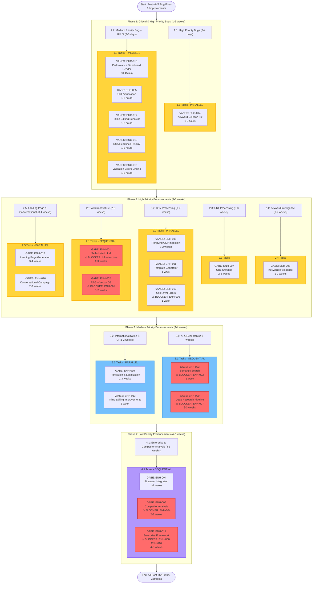

# Task List: Post-MVP Bug Fixes & Improvements

**Document Version**: 1.1  
**Created**: 2025-11-11  
**Last Updated**: 2025-11-11 - Fixed BUG-010, BUG-013, BUG-014; Fixed headers across all pages  
**Project Timeline**: 12-16 weeks for full implementation  
**Target**: Complete all bug fixes and implement all planned enhancements  
**Framework**: TypeScript + Node.js + Express + React  
**Integration**: Post-MVP improvements to Agentic Campaign Manager Module  
**Collaborators**: GABE, VANES (working in parallel)

---

## Progress Summary

### Open Bugs (5 bugs remaining)
- **🔴 Critical**: 0 bugs
- **🟠 High Priority**: 0 bugs (BUG-014 fixed)
- **🟡 Medium Priority**: 5 bugs (BUG-005, BUG-012, BUG-015)

### Planned Enhancements (16 enhancements)
- **🟠 High Priority**: 9 enhancements (ENH-001, ENH-002, ENH-006, ENH-007, ENH-008, ENH-015, ENH-016)
- **🟡 Medium Priority**: 6 enhancements (ENH-003, ENH-009, ENH-010, ENH-011, ENH-012, ENH-013)
- **🟢 Low Priority**: 1 enhancement (ENH-014)

**Total Work Items**: 21 (5 bugs + 16 enhancements)  
**Estimated Total Time**: 11-15 weeks  
**Completed**: 3 bugs (BUG-010, BUG-013, BUG-014)

---

## Overview

This document provides a granular, step-by-step task list for implementing all Post-MVP bug fixes and enhancements. Tasks are organized into phases with clear dependencies and parallel work opportunities. Each phase includes detailed subphases with specific tasks assigned to GABE and VANES.

**Workflow Rules**:
- Complete all tasks in a subphase before proceeding
- Pause for confirmation after each subphase completion
- Run unit tests after each subphase completion
- Do not proceed to next phase until current phase is tested and confirmed
- Follow existing Agentic Campaign Manager code patterns and architecture
- Use PowerShell syntax for all commands
- **Parallel Work**: GABE and VANES can work on different subphases simultaneously
- **Dependencies**: Check task dependencies before starting work
- **Blockers**: Clearly marked with ⚠️ BLOCKER

**Collaborator Assignments**:
- **GABE**: Backend services, API integrations, infrastructure, high-complexity features
- **VANES**: Frontend components, UI/UX improvements, testing, documentation

**Priority Order**:
1. **Phase 1**: Critical & High Priority Bugs (Must fix first)
2. **Phase 2**: High Priority Enhancements (Core improvements)
3. **Phase 3**: Medium Priority Bugs (Polish)
4. **Phase 4**: Medium Priority Enhancements (Feature additions)
5. **Phase 5**: Low Priority Enhancements (Future work)

---

## Phase 1: Critical & High Priority Bug Fixes (1-2 weeks)

**Priority**: 🔴 Critical  
**Estimated Time**: 1-2 weeks  
**Goal**: Fix all critical and high priority bugs before proceeding to enhancements

### Phase 1.1: High Priority Bug Fixes (3-4 days)

#### Task 1.1.1: Fix BUG-014 - Keyword Deletion Deletes Incorrect Item ⚠️ HIGH PRIORITY ✅ COMPLETED
**Assigned to**: VANES  
**Dependencies**: None  
**Status**: ✅ Fixed (Verified - already implemented)  
**Estimated Time**: 1-2 hours  
**Priority**: 🟠 High  
**Completed**: 2025-11-11

**Description**:
Deleting a keyword removes the item at +1 position instead of selected keyword. Critical data integrity issue causing wrong keyword deletion.

**Tasks**:
- [x] Read `src/components/campaign-preview/KeywordRow.tsx` to understand current deletion logic
- [x] Identify the bug: deletion uses incorrect index or ID comparison
- [x] Verify deletion logic uses correct index-based deletion (already implemented)
- [x] Test deletion with multiple keywords
- [x] Verify correct keyword is deleted
- [x] Review `src/store/campaignPreviewStore.ts` - confirmed index-based deletion
- [x] Test edge cases (first item, last item, single item)
- [x] Verify no regressions in other keyword operations

**Related Files**:
- `src/components/campaign-preview/KeywordRow.tsx` - Main component
- `src/store/campaignPreviewStore.ts` - Store logic
- `src/utils/keywordUtils.ts` - Utility functions (if exists)

**Testing**:
- [ ] Test deleting first keyword
- [ ] Test deleting middle keyword
- [ ] Test deleting last keyword
- [ ] Test deleting with single keyword
- [ ] Test deleting multiple keywords in sequence
- [ ] Verify no other keywords are affected

---

### Phase 1.2: Medium Priority Bug Fixes - UI/UX (2-3 days)

#### Task 1.2.1: Fix BUG-010 - Performance Dashboard Header Should Remain Static ✅ COMPLETED
**Assigned to**: VANES  
**Dependencies**: None  
**Status**: ✅ Fixed  
**Estimated Time**: 30-45 minutes  
**Priority**: 🟡 Medium  
**Completed**: 2025-11-11

**Description**:
Performance Dashboard header (title, time range selector, export button, status indicators) scrolls off-screen when scrolling through performance metrics. Users cannot change time range or export data while viewing performance metrics.

**Tasks**:
- [x] Read `src/components/performance/PerformanceDashboard.tsx` to understand current layout
- [x] Identify header section in component
- [x] Add CSS sticky positioning to header section
- [x] Ensure header remains fixed at top while scrolling
- [x] Test with different screen sizes (mobile, tablet, desktop)
- [x] Verify header doesn't overlap content
- [x] Test scrolling behavior
- [x] Verify all header elements remain accessible

**Related Files**:
- `src/components/performance/PerformanceDashboard.tsx` - Main component
- `src/components/performance/PerformanceHeader.tsx` - Header component (if exists)

**CSS Solution**:
```tsx
// Add sticky positioning to header
<div className="sticky top-0 z-10 bg-background border-b">
  {/* Header content */}
</div>
```

**Testing**:
- [ ] Test scrolling with long performance data
- [ ] Test header remains accessible while scrolling
- [ ] Test on mobile devices
- [ ] Test on tablet devices
- [ ] Test on desktop
- [ ] Verify header doesn't overlap content

---

#### Task 1.2.2: Fix BUG-005 - URLs Not Verified to Exist/Be Reachable
**Assigned to**: GABE  
**Dependencies**: None  
**Status**: 🔴 Open  
**Estimated Time**: 1-2 hours  
**Priority**: 🟡 Medium

**Description**:
URLs are only validated for format, not verified to exist/be reachable. Invalid or broken URLs can pass validation and cause downstream issues during campaign generation.

**Tasks**:
- [ ] Read `backend/src/services/productParsingService.ts` to understand current URL validation
- [ ] Add URL verification function (HTTP HEAD or GET request)
- [ ] Implement optional URL verification (configurable)
- [ ] Add timeout handling (5-10 seconds)
- [ ] Add error handling for unreachable URLs
- [ ] Add warning messages for unreachable URLs
- [ ] Update CSV upload to use URL verification
- [ ] Update URL list input to use URL verification
- [ ] Add configuration option to enable/disable verification
- [ ] Add unit tests for URL verification

**Related Files**:
- `backend/src/services/productParsingService.ts` - CSV parsing service
- `backend/src/utils/urlVerification.ts` - New utility (create)
- `src/components/csv-upload/CSVUploadScreen.tsx` - CSV upload UI
- `src/components/csv-upload/URLListInput.tsx` - URL input component

**Implementation**:
```typescript
// Create urlVerification.ts
export async function verifyUrl(url: string, timeout = 5000): Promise<boolean> {
  try {
    const response = await fetch(url, {
      method: 'HEAD',
      signal: AbortSignal.timeout(timeout),
    });
    return response.ok;
  } catch (error) {
    return false;
  }
}
```

**Testing**:
- [ ] Test with valid URLs
- [ ] Test with invalid URLs (404, 500, etc.)
- [ ] Test with unreachable URLs (timeout)
- [ ] Test with malformed URLs
- [ ] Test timeout handling
- [ ] Test error handling
- [ ] Verify warnings are displayed correctly

---

#### Task 1.2.3: Fix BUG-012 - Inline Editing Behavior Issues
**Assigned to**: VANES  
**Dependencies**: None  
**Status**: 🔴 Open  
**Estimated Time**: 1-2 hours  
**Priority**: 🟡 Medium

**Description**:
Inline editing saves automatically on blur instead of requiring explicit "Save" button. Inline editing is enabled by clicking text directly instead of "Edit" button. Match type dropdown closes inline edit state when clicked.

**Tasks**:
- [ ] Read `src/components/campaign-preview/KeywordRow.tsx` to understand current inline editing
- [ ] Read `src/components/campaign-preview/AdGroupRow.tsx` to understand current inline editing
- [ ] Add explicit "Save" and "Cancel" buttons
- [ ] Require "Edit" button activation before editing
- [ ] Fix match type dropdown to not close edit state
- [ ] Update inline editing logic to use Save/Cancel
- [ ] Test inline editing for keywords
- [ ] Test inline editing for ad groups
- [ ] Test inline editing for ads
- [ ] Add keyboard shortcuts (Enter to save, Esc to cancel)
- [ ] Add visual feedback for edit state

**Related Files**:
- `src/components/campaign-preview/KeywordRow.tsx` - Keyword editing
- `src/components/campaign-preview/AdGroupRow.tsx` - Ad group editing
- `src/components/campaign-preview/AdRow.tsx` - Ad editing (if exists)
- `src/store/campaignPreviewStore.ts` - Store logic
- `src/utils/inlineEditing.ts` - Utility functions (if exists)

**Implementation**:
```tsx
// Add Save/Cancel buttons
{isEditing ? (
  <div className="flex gap-2">
    <Button onClick={handleSave}>Save</Button>
    <Button variant="outline" onClick={handleCancel}>Cancel</Button>
  </div>
) : (
  <Button onClick={handleEdit}>Edit</Button>
)}
```

**Testing**:
- [ ] Test Save button saves changes
- [ ] Test Cancel button discards changes
- [ ] Test Edit button activates edit mode
- [ ] Test match type dropdown doesn't close edit state
- [ ] Test keyboard shortcuts (Enter, Esc)
- [ ] Test visual feedback for edit state
- [ ] Test multiple simultaneous edits

---

#### Task 1.2.4: Fix BUG-013 - RSA Ad Headlines Display Not Optimized ✅ COMPLETED
**Assigned to**: VANES  
**Dependencies**: None  
**Status**: ✅ Fixed  
**Estimated Time**: 1-2 hours  
**Priority**: 🟡 Medium  
**Completed**: 2025-11-11

**Description**:
RSA Ad headlines displayed as vertical list instead of organized table format. Less structured and visually organized compared to keyword display. Makes it harder to quickly review and compare multiple headlines.

**Tasks**:
- [x] Read `src/components/campaign-preview/AdRow.tsx` or similar component
- [x] Identify current headline display structure
- [x] Refactor headlines display to use table structure
- [x] Match table structure to keyword display
- [x] Add table headers (Headline, Status, Actions)
- [x] Add inline editing for headlines
- [x] Add delete functionality for headlines
- [x] Test table display with multiple headlines
- [x] Verify visual consistency with keyword display
- [x] Test responsive design (mobile, tablet, desktop)

**Related Files**:
- `src/components/campaign-preview/AdRow.tsx` - Ad component
- `src/components/campaign-preview/HeadlineRow.tsx` - Headline component (if exists)
- `src/store/campaignPreviewStore.ts` - Store logic

**Implementation**:
```tsx
// Refactor to table structure
<table className="w-full">
  <thead>
    <tr>
      <th>Headline</th>
      <th>Status</th>
      <th>Actions</th>
    </tr>
  </thead>
  <tbody>
    {headlines.map((headline, index) => (
      <HeadlineRow key={index} headline={headline} />
    ))}
  </tbody>
</table>
```

**Testing**:
- [ ] Test table display
- [ ] Test with multiple headlines
- [ ] Test table structure matches keyword display
- [ ] Test responsive design
- [ ] Test inline editing
- [ ] Test delete functionality

---

#### Task 1.2.5: Fix BUG-015 - Validation Errors Not Linked to Elements
**Assigned to**: VANES  
**Dependencies**: None  
**Status**: 🔴 Open  
**Estimated Time**: 1-2 hours  
**Priority**: 🟡 Medium

**Description**:
Validation errors are displayed in summary but not linked to actual elements on page. Users cannot navigate to or find where errors are located. Makes it difficult to fix validation errors.

**Tasks**:
- [ ] Read `src/components/campaign-preview/CampaignPreview.tsx` to understand validation error display
- [ ] Identify validation error summary component
- [ ] Add clickable links to validation errors
- [ ] Implement scroll-to functionality for error locations
- [ ] Add error indicators to specific elements
- [ ] Add error tooltips with detailed messages
- [ ] Test navigation to error locations
- [ ] Test scroll-to functionality
- [ ] Test error indicators
- [ ] Test error tooltips

**Related Files**:
- `src/components/campaign-preview/CampaignPreview.tsx` - Preview component
- `src/components/campaign-preview/ValidationSummary.tsx` - Validation summary (if exists)
- `src/services/validationService.ts` - Validation service
- `src/utils/scrollToElement.ts` - Scroll utility (create if needed)

**Implementation**:
```tsx
// Add clickable error links
{errors.map((error, index) => (
  <button
    key={index}
    onClick={() => scrollToElement(error.elementId)}
    className="text-red-500 hover:underline"
  >
    {error.message}
  </button>
))}
```

**Testing**:
- [ ] Test clickable error links
- [ ] Test scroll-to functionality
- [ ] Test error indicators
- [ ] Test error tooltips
- [ ] Test with multiple errors
- [ ] Test navigation to different error types

---

## Phase 2: High Priority Enhancements (4-6 weeks)

**Priority**: 🟠 High  
**Estimated Time**: 4-6 weeks  
**Goal**: Implement high priority enhancements that provide significant value

### Phase 2.1: AI Infrastructure Enhancements (2-3 weeks)

#### Task 2.1.1: Implement ENH-001 - Self-Hosted LLM Integration ⚠️ BLOCKER: Infrastructure Compliance
**Assigned to**: GABE  
**Dependencies**: Infrastructure compliance verification  
**Status**: 🔴 Planned  
**Estimated Time**: 2-3 weeks  
**Priority**: 🟠 High

**Description**:
Replace generic OpenAI API calls with self-hosted fine-tuned LLM models for high-volume, repetitive tasks. Use hybrid approach: self-hosted for high-volume tasks, external API (Claude 3.5 Sonnet) for strategic decisions.

**Tasks**:
- [ ] ⚠️ **BLOCKER**: Verify infrastructure compliance and error resolution
- [ ] Research self-hosted LLM options (Llama 3 8B, Mistral 7B)
- [ ] Set up EC2 GPU instance (g5.xlarge spot: ~$220/month)
- [ ] Deploy fine-tuned LLM model
- [ ] Create `backend/src/services/llm/selfHostedLLMService.ts`
- [ ] Implement LLM API client
- [ ] Add model routing logic in `marketingLLMService.ts`
- [ ] Update `rsaGenerationService.ts` to use self-hosted LLM
- [ ] Update `keywordGenerationService.ts` to use self-hosted LLM
- [ ] Implement hybrid approach (self-hosted for high-volume, external for strategic)
- [ ] Add configuration for model selection
- [ ] Add fallback to external API if self-hosted fails
- [ ] Add monitoring and logging
- [ ] Add unit tests
- [ ] Add integration tests
- [ ] Performance testing (1000+ generations/day)

**Related Files**:
- `ENHANCED-LLM-AND-COMPETITOR-ANALYSIS-PLAN.md` - Planning document
- `backend/src/services/llm/selfHostedLLMService.ts` - New service
- `backend/src/services/llm/marketingLLMService.ts` - New service
- `backend/src/services/rsaGenerationService.ts` - Update existing
- `backend/src/services/keywordGenerationService.ts` - Update existing

**Testing**:
- [ ] Test self-hosted LLM connectivity
- [ ] Test model routing logic
- [ ] Test fallback to external API
- [ ] Test performance (1000+ generations/day)
- [ ] Test cost savings
- [ ] Test error handling

---

#### Task 2.1.2: Implement ENH-002 - RAG + Vector Database Integration
**Assigned to**: GABE  
**Dependencies**: ENH-001 (Self-Hosted LLM)  
**Status**: 🔴 Planned  
**Estimated Time**: 1-2 weeks  
**Priority**: 🟠 High

**Description**:
Implement Retrieval-Augmented Generation (RAG) using Pinecone vector database to enhance LLM responses with marketing-specific knowledge.

**Tasks**:
- [ ] ⚠️ **BLOCKER**: Complete ENH-001 first
- [ ] Set up Pinecone account and create index (Starter: $70/month, Standard: $200/month)
- [ ] Create embedding pipeline for marketing documents
- [ ] Ingest knowledge sources:
  - [ ] Google Ads documentation and best practices
  - [ ] Meta Ads documentation and best practices
  - [ ] Industry marketing guides (WordStream, HubSpot, etc.)
  - [ ] Successful campaign examples (anonymized)
  - [ ] Keyword research data
  - [ ] Ad copy templates and examples
  - [ ] Platform-specific guidelines
- [ ] Create `backend/src/services/llm/ragService.ts`
- [ ] Create `backend/src/services/llm/vectorDBService.ts`
- [ ] Implement RAG retrieval logic
- [ ] Integrate RAG context injection into LLM prompts
- [ ] Add unit tests
- [ ] Add integration tests
- [ ] Performance testing

**Related Files**:
- `ENHANCED-LLM-AND-COMPETITOR-ANALYSIS-PLAN.md` - Planning document
- `backend/src/services/llm/ragService.ts` - New service
- `backend/src/services/llm/vectorDBService.ts` - New service

**Testing**:
- [ ] Test Pinecone connectivity
- [ ] Test embedding pipeline
- [ ] Test knowledge ingestion
- [ ] Test RAG retrieval
- [ ] Test context injection
- [ ] Test LLM response quality improvement

---

### Phase 2.2: CSV Processing Enhancements (1-2 weeks)

#### Task 2.2.1: Implement ENH-006 - Forgiving CSV Ingestion with Flexible Schema
**Assigned to**: VANES  
**Dependencies**: None  
**Status**: 🔴 Planned  
**Estimated Time**: 1-2 weeks  
**Priority**: 🟠 High

**Description**:
Make CSV ingestion forgiving and flexible to handle typos, optional columns, variable schemas, and missing data. Add template generator for new users and implement Fethonomics-like functionality with error localization and validation feedback.

**Tasks**:
- [ ] Read `backend/src/services/productParsingService.ts` to understand current CSV parsing
- [ ] Enhance schema detection with fuzzy column name matching
- [ ] Add typo correction and fuzzy matching for column names
- [ ] Implement flexible schema detection (different column orders, optional columns)
- [ ] Add cell-level error tracking and display
- [ ] Create `src/components/csv-upload/CSVTemplateGenerator.tsx`
- [ ] Add template generator UI component
- [ ] Add validation feedback with clear error messages
- [ ] Consider Fethonomics patterns for error localization
- [ ] Support variable schemas (different column orders, optional columns)
- [ ] Add unit tests
- [ ] Add integration tests
- [ ] Test with various CSV formats

**Related Files**:
- `MEETING-SUMMARY-WISTER-2025-11-11.md` - Meeting notes
- `backend/src/services/productParsingService.ts` - Update existing
- `src/components/csv-upload/CSVUploadComponent.tsx` - Update existing
- `src/components/csv-upload/ProductPreview.tsx` - Update existing
- `src/components/csv-upload/CSVTemplateGenerator.tsx` - New component

**Testing**:
- [ ] Test fuzzy column name matching
- [ ] Test typo correction
- [ ] Test flexible schema detection
- [ ] Test cell-level error tracking
- [ ] Test template generator
- [ ] Test validation feedback
- [ ] Test with various CSV formats

---

#### Task 2.2.2: Implement ENH-011 - Template Generator for CSV Upload
**Assigned to**: VANES  
**Dependencies**: None  
**Status**: 🔴 Planned  
**Estimated Time**: 1 week  
**Priority**: 🟡 Medium

**Description**:
Add template generator for new users to create properly formatted CSV files. Help users understand required and optional columns. Provide downloadable CSV templates with example data.

**Tasks**:
- [ ] Create `src/components/csv-upload/CSVTemplateGenerator.tsx`
- [ ] Generate CSV templates with example data
- [ ] Add "Download Template" button in CSV upload UI
- [ ] Include column descriptions and requirements
- [ ] Support multiple template formats (basic, advanced, custom)
- [ ] Add template customization options
- [ ] Add unit tests
- [ ] Add integration tests

**Related Files**:
- `MEETING-SUMMARY-WISTER-2025-11-11.md` - Meeting notes
- `src/components/csv-upload/CSVTemplateGenerator.tsx` - New component
- `src/components/csv-upload/CSVUploadScreen.tsx` - Update existing
- `backend/src/services/csvTemplateService.ts` - New service

**Testing**:
- [ ] Test template generation
- [ ] Test template download
- [ ] Test multiple template formats
- [ ] Test template customization
- [ ] Test column descriptions

---

#### Task 2.2.3: Implement ENH-012 - Cell-Level Error Display & Validation Feedback
**Assigned to**: VANES  
**Dependencies**: ENH-006 (Forgiving CSV Ingestion)  
**Status**: 🔴 Planned  
**Estimated Time**: 1 week  
**Priority**: 🟡 Medium

**Description**:
Show cell-level errors in CSV upload with clear validation feedback. Link errors to specific cells in the CSV preview. Provide actionable error messages with suggestions for fixes.

**Tasks**:
- [ ] ⚠️ **BLOCKER**: Complete ENH-006 first
- [ ] Enhance `ProductPreview.tsx` with cell-level error display
- [ ] Add error indicators to specific cells
- [ ] Implement clickable error links to navigate to errors
- [ ] Add error tooltips with detailed messages
- [ ] Provide error fix suggestions
- [ ] Color-code cells with errors (red border, error icon)
- [ ] Add error summary with navigation links
- [ ] Add unit tests
- [ ] Add integration tests

**Related Files**:
- `MEETING-SUMMARY-WISTER-2025-11-11.md` - Meeting notes
- `src/components/csv-upload/ProductPreview.tsx` - Update existing
- `src/services/validationService.ts` - Update existing
- `backend/src/services/productParsingService.ts` - Update existing

**Testing**:
- [ ] Test cell-level error indicators
- [ ] Test error tooltips
- [ ] Test clickable error links
- [ ] Test error summary navigation
- [ ] Test error fix suggestions
- [ ] Test with multiple errors

---

### Phase 2.3: URL Processing Enhancements (2-3 weeks)

#### Task 2.3.1: Implement ENH-007 - URL Crawling with Semantic Extraction
**Assigned to**: GABE  
**Dependencies**: None  
**Status**: 🔴 Planned  
**Estimated Time**: 2-3 weeks  
**Priority**: 🟠 High

**Description**:
Build crawler to extract structured data (product features, benefits, category info) from provided URLs. Implement semantic crawling to extract product details and competitor insights. Incorporate keyword vectorization to semantically group campaigns.

**Tasks**:
- [ ] Research web crawling libraries (Puppeteer, Playwright, Cheerio)
- [ ] Create `backend/src/services/urlCrawling/urlCrawlingService.ts`
- [ ] Implement web crawling logic
- [ ] Create `backend/src/services/urlCrawling/contentAnalyzer.ts`
- [ ] Implement semantic content extraction (product features, benefits, category)
- [ ] Create `backend/src/services/urlCrawling/semanticExtractor.ts`
- [ ] Add keyword vectorization for semantic grouping
- [ ] Integrate with campaign generation flow
- [ ] Extract competitor insights from URLs
- [ ] Use open-source LLMs or APIs for content analysis
- [ ] Implement caching for crawled content
- [ ] Add unit tests
- [ ] Add integration tests
- [ ] Performance testing

**Related Files**:
- `MEETING-SUMMARY-WISTER-2025-11-11.md` - Meeting notes
- `backend/src/services/urlCrawling/urlCrawlingService.ts` - New service
- `backend/src/services/urlCrawling/contentAnalyzer.ts` - New service
- `backend/src/services/urlCrawling/semanticExtractor.ts` - New service
- `src/components/csv-upload/URLListInput.tsx` - Update existing

**Testing**:
- [ ] Test web crawling
- [ ] Test content extraction
- [ ] Test semantic extraction
- [ ] Test keyword vectorization
- [ ] Test competitor insights
- [ ] Test caching
- [ ] Test performance

---

### Phase 2.4: Keyword Intelligence Enhancements (1-2 weeks)

#### Task 2.4.1: Implement ENH-008 - Smart Keyword Intelligence & Filtering
**Assigned to**: GABE  
**Dependencies**: None  
**Status**: 🔴 Planned  
**Estimated Time**: 1-2 weeks  
**Priority**: 🟠 High

**Description**:
Implement LLM-based filtering for broad vs. specific keyword checks. Add keyword evaluation layer to flag overly broad terms before finalizing output. Allow marketers to edit or delete keywords inline easily. Tune keyword generation (currently "dumb" due to generic LLM output).

**Tasks**:
- [ ] Create `backend/src/services/keywordIntelligenceService.ts`
- [ ] Implement LLM-based filtering for broad vs. specific keywords
- [ ] Add keyword evaluation layer with scoring
- [ ] Enhance inline editing in campaign preview
- [ ] Tune keyword generation prompts for better output
- [ ] Add keyword quality scoring and recommendations
- [ ] Implement keyword deletion with confirmation
- [ ] Add unit tests
- [ ] Add integration tests

**Related Files**:
- `MEETING-SUMMARY-WISTER-2025-11-11.md` - Meeting notes
- `backend/src/services/keywordGenerationService.ts` - Update existing
- `backend/src/services/keywordIntelligenceService.ts` - New service
- `src/components/campaign-preview/KeywordRow.tsx` - Update existing
- `src/hooks/useKeywordGeneration.ts` - Update existing

**Testing**:
- [ ] Test broad keyword detection
- [ ] Test keyword quality scoring
- [ ] Test specificity analysis
- [ ] Test match type recommendations
- [ ] Test inline editing
- [ ] Test keyword deletion

---

### Phase 2.5: Landing Page & Conversational Enhancements (3-4 weeks)

#### Task 2.5.1: Implement ENH-015 - AI-Powered Landing Page Generation
**Assigned to**: GABE  
**Dependencies**: None  
**Status**: 🔴 Planned  
**Estimated Time**: 3-4 weeks  
**Priority**: 🟠 High

**Description**:
Generate optimized landing pages automatically from campaign context to replace generic linktree pages. Help newer customers improve conversion rates by providing purpose-built landing pages that match their ad campaigns.

**Tasks**:
- [ ] Research landing page generation approaches
- [ ] Create `backend/src/services/landingPage/landingPageGenerationService.ts`
- [ ] Integrate with campaign generation flow (use campaign context)
- [ ] Generate landing pages with:
  - [ ] Campaign-aligned messaging and headlines
  - [ ] Product/service information from campaign
  - [ ] Clear call-to-action (CTA) buttons
  - [ ] Mobile-responsive design
  - [ ] SEO optimization
  - [ ] Conversion tracking integration
- [ ] Create landing page templates (multiple styles)
- [ ] Create `src/components/landing-page/LandingPagePreview.tsx`
- [ ] Create `src/components/landing-page/LandingPageEditor.tsx`
- [ ] Integrate with hosting/CDN service (Vercel, Netlify, or custom)
- [ ] Add landing page analytics and conversion tracking
- [ ] Support custom domain mapping
- [ ] Add unit tests
- [ ] Add integration tests

**Related Files**:
- `MEETING-SUMMARY-GT-SCHOOL-2025-11-11.md` - Meeting notes
- `backend/src/services/landingPage/landingPageGenerationService.ts` - New service
- `backend/src/services/landingPage/landingPageTemplateService.ts` - New service
- `src/components/landing-page/LandingPagePreview.tsx` - New component
- `src/components/landing-page/LandingPageEditor.tsx` - New component
- `src/components/campaign-generation/LandingPageIntegration.tsx` - New component

**Testing**:
- [ ] Test landing page generation
- [ ] Test campaign context integration
- [ ] Test multiple template styles
- [ ] Test mobile-responsive design
- [ ] Test SEO optimization
- [ ] Test conversion tracking
- [ ] Test custom domain mapping

---

#### Task 2.5.2: Implement ENH-016 - Enhanced Conversational Campaign Creation
**Assigned to**: VANES  
**Dependencies**: Existing ConversationalInterface component  
**Status**: 🔴 Planned  
**Estimated Time**: 2-3 weeks  
**Priority**: 🟠 High

**Description**:
Enhance the conversational campaign creation workflow to support a more natural, iterative process where users explain what they're trying to do rather than providing structured inputs (URLs, CSV files).

**Tasks**:
- [ ] Read `src/components/ConversationalInterface.tsx` to understand current implementation
- [ ] Enhance existing `ConversationalInterface.tsx` component
- [ ] Improve `aiService.ts` to handle conversational campaign planning
- [ ] Add iterative refinement flow:
  - [ ] Initial goal understanding
  - [ ] Clarifying questions (budget, audience, timeline)
  - [ ] Campaign structure proposal
  - [ ] User feedback and refinement
  - [ ] Final campaign generation
- [ ] Add context memory (remember previous conversation)
- [ ] Support multi-turn conversations (build campaigns over time)
- [ ] Add campaign preview in conversation (show progress)
- [ ] Integrate with campaign generation service
- [ ] Add conversation history and resume capability
- [ ] Create `src/services/conversationalCampaignService.ts`
- [ ] Create `backend/src/services/conversationalCampaignService.ts`
- [ ] Add unit tests
- [ ] Add integration tests

**Related Files**:
- `MEETING-SUMMARY-GT-SCHOOL-2025-11-11.md` - Meeting notes
- `src/components/ConversationalInterface.tsx` - Update existing
- `src/services/aiService.ts` - Update existing
- `src/services/conversationalCampaignService.ts` - New service
- `src/store/conversationStore.ts` - Update existing
- `backend/src/services/conversationalCampaignService.ts` - New service

**Testing**:
- [ ] Test natural language understanding
- [ ] Test iterative refinement
- [ ] Test context memory
- [ ] Test multi-turn conversations
- [ ] Test campaign preview in conversation
- [ ] Test conversation history
- [ ] Test resume capability

---

## Phase 3: Medium Priority Enhancements (3-4 weeks)

**Priority**: 🟡 Medium  
**Estimated Time**: 3-4 weeks  
**Goal**: Implement medium priority enhancements that add value

### Phase 3.1: AI & Research Enhancements (2-3 weeks)

#### Task 3.1.1: Implement ENH-003 - Semantic Search for Synonym Generation
**Assigned to**: GABE  
**Dependencies**: ENH-002 (RAG + Vector Database)  
**Status**: 🔴 Planned  
**Estimated Time**: 1 week  
**Priority**: 🟡 Medium

**Description**:
Implement semantic search using vector similarity to generate relevant synonyms and related keywords for campaign generation.

**Tasks**:
- [ ] ⚠️ **BLOCKER**: Complete ENH-002 first
- [ ] Create `backend/src/services/llm/semanticSearchService.ts`
- [ ] Vectorize existing keywords in campaigns
- [ ] Implement synonym generation using semantic search + LLM
- [ ] Integrate with `keywordGenerationService.ts`
- [ ] Add synonym suggestions in campaign preview
- [ ] Add unit tests
- [ ] Add integration tests

**Related Files**:
- `ENHANCED-LLM-AND-COMPETITOR-ANALYSIS-PLAN.md` - Planning document
- `backend/src/services/llm/semanticSearchService.ts` - New service
- `backend/src/services/keywordGenerationService.ts` - Update existing

**Testing**:
- [ ] Test semantic search
- [ ] Test synonym generation
- [ ] Test keyword vectorization
- [ ] Test synonym suggestions
- [ ] Test integration with keyword generation

---

#### Task 3.1.2: Implement ENH-009 - Deep Research Pipeline for Competitor & Market Analysis
**Assigned to**: GABE  
**Dependencies**: ENH-007 (URL Crawling)  
**Status**: 🔴 Planned  
**Estimated Time**: 2-3 weeks  
**Priority**: 🟡 Medium

**Description**:
Use open-source LLMs or APIs to analyze competitors and market keywords before generation. Implement deep research pipeline to analyze competitors and market keywords.

**Tasks**:
- [ ] ⚠️ **BLOCKER**: Complete ENH-007 first
- [ ] Research open-source LLMs (DeepResearch) or APIs
- [ ] Create `backend/src/services/research/deepResearchService.ts`
- [ ] Integrate open-source LLMs (DeepResearch) or APIs
- [ ] Implement competitor keyword analysis
- [ ] Add market keyword research pipeline
- [ ] Analyze competitor ad copy and strategies
- [ ] Generate strategic recommendations
- [ ] Integrate insights into campaign generation flow
- [ ] Create `backend/src/services/research/competitorAnalyzer.ts`
- [ ] Create `backend/src/services/research/marketKeywordResearch.ts`
- [ ] Add unit tests
- [ ] Add integration tests

**Related Files**:
- `MEETING-SUMMARY-WISTER-2025-11-11.md` - Meeting notes
- `backend/src/services/research/deepResearchService.ts` - New service
- `backend/src/services/research/competitorAnalyzer.ts` - New service
- `backend/src/services/research/marketKeywordResearch.ts` - New service

**Testing**:
- [ ] Test competitor analysis
- [ ] Test market keyword research
- [ ] Test strategic recommendations
- [ ] Test integration with campaign generation
- [ ] Test performance

---

### Phase 3.2: Internationalization & UI Enhancements (1-2 weeks)

#### Task 3.2.1: Implement ENH-010 - Translation & Localization for Multilingual Campaigns
**Assigned to**: GABE  
**Dependencies**: None  
**Status**: 🔴 Planned  
**Estimated Time**: 2-3 weeks  
**Priority**: 🟡 Medium

**Description**:
Add translation or localization capabilities for multilingual campaign support. Target multi-language or multi-region campaigns that Google doesn't support natively.

**Tasks**:
- [ ] Research translation APIs (Google Translate, DeepL, or self-hosted)
- [ ] Create `backend/src/services/translationService.ts`
- [ ] Integrate translation API (Google Translate, DeepL, or self-hosted)
- [ ] Implement localization for ad copy, keywords, descriptions
- [ ] Add language selection in campaign generation
- [ ] Support multiple languages per campaign
- [ ] Implement region-specific campaign variations
- [ ] Add translation quality validation
- [ ] Create `backend/src/services/localizationService.ts`
- [ ] Update `src/components/campaign-generation/CampaignGenerationScreen.tsx`
- [ ] Add unit tests
- [ ] Add integration tests

**Related Files**:
- `MEETING-SUMMARY-WISTER-2025-11-11.md` - Meeting notes
- `backend/src/services/translationService.ts` - New service
- `backend/src/services/localizationService.ts` - New service
- `src/components/campaign-generation/CampaignGenerationScreen.tsx` - Update existing

**Testing**:
- [ ] Test translation API integration
- [ ] Test ad copy translation
- [ ] Test keyword translation
- [ ] Test multiple languages
- [ ] Test region-specific variations
- [ ] Test translation quality

---

#### Task 3.2.2: Implement ENH-013 - Inline Keyword Editing & Deletion Improvements
**Assigned to**: VANES  
**Dependencies**: None  
**Status**: 🔴 Planned  
**Estimated Time**: 1 week  
**Priority**: 🟡 Medium

**Description**:
Allow marketers to edit or delete keywords inline easily. Improve inline editing behavior with explicit Save/Cancel buttons. Fix keyword deletion to remove correct items. Add undo support for deleted keywords.

**Tasks**:
- [ ] Enhance `KeywordRow.tsx` with improved inline editing
- [ ] Add explicit Save/Cancel buttons
- [ ] Fix keyword deletion to use correct index
- [ ] Add undo support for deleted keywords
- [ ] Improve inline editing validation
- [ ] Add keyboard shortcuts for editing
- [ ] Add unit tests
- [ ] Add integration tests

**Related Files**:
- `MEETING-SUMMARY-WISTER-2025-11-11.md` - Meeting notes
- `src/components/campaign-preview/KeywordRow.tsx` - Update existing
- `src/store/campaignPreviewStore.ts` - Update existing
- `src/utils/inlineEditing.ts` - Update existing

**Testing**:
- [ ] Test explicit Save/Cancel buttons
- [ ] Test keyword deletion
- [ ] Test undo support
- [ ] Test inline editing validation
- [ ] Test keyboard shortcuts
- [ ] Test visual feedback

---

## Phase 4: Low Priority Enhancements (4-6 weeks)

**Priority**: 🟢 Low  
**Estimated Time**: 4-6 weeks  
**Goal**: Implement low priority enhancements for future work

### Phase 4.1: Enterprise & Competitor Analysis (4-6 weeks)

#### Task 4.1.1: Implement ENH-004 - URL Crawling & Content Analysis (Firecrawl)
**Assigned to**: GABE  
**Dependencies**: None  
**Status**: 🔴 Planned  
**Estimated Time**: 1-2 weeks  
**Priority**: 🟡 Medium

**Description**:
Integrate Firecrawl to crawl provided URLs and extract structured content (title, description, pricing, features) to generate smarter campaigns based on actual website content.

**Tasks**:
- [ ] Set up Firecrawl account (Starter: $20/month, Growth: $100/month)
- [ ] Create `backend/src/services/urlCrawling/urlCrawlingService.ts` for Firecrawl integration
- [ ] Create `backend/src/services/urlCrawling/contentAnalyzer.ts` for content extraction
- [ ] Implement caching in Redis (24-hour TTL)
- [ ] Integrate with campaign generation flow
- [ ] Pass crawled content to LLM services
- [ ] Add unit tests
- [ ] Add integration tests

**Related Files**:
- `ENHANCED-LLM-AND-COMPETITOR-ANALYSIS-PLAN.md` - Planning document
- `backend/src/services/urlCrawling/urlCrawlingService.ts` - New service
- `backend/src/services/urlCrawling/contentAnalyzer.ts` - New service

**Testing**:
- [ ] Test Firecrawl integration
- [ ] Test content extraction
- [ ] Test caching
- [ ] Test integration with campaign generation
- [ ] Test performance

---

#### Task 4.1.2: Implement ENH-005 - Competitor Analysis Feature
**Assigned to**: GABE  
**Dependencies**: ENH-004 (URL Crawling)  
**Status**: 🔴 Planned  
**Estimated Time**: 2-3 weeks  
**Priority**: 🟡 Medium

**Description**:
Add separate feature accessible during campaign preview (not part of ad creation flow) to analyze competitor advertisements and provide improvement recommendations with confidence scores.

**Tasks**:
- [ ] ⚠️ **BLOCKER**: Complete ENH-004 first
- [ ] Create `backend/src/services/competitorAnalysis/competitorAnalysisService.ts`
- [ ] Create `backend/src/services/competitorAnalysis/competitorCrawler.ts`
- [ ] Create `backend/src/services/competitorAnalysis/recommendationEngine.ts`
- [ ] Create `backend/src/services/competitorAnalysis/confidenceScorer.ts`
- [ ] Add API endpoint: `POST /api/campaigns/:id/competitor-analysis`
- [ ] Add "Competitor Analysis" button in campaign preview UI
- [ ] Display recommendations with confidence scores
- [ ] Add unit tests
- [ ] Add integration tests

**Related Files**:
- `ENHANCED-LLM-AND-COMPETITOR-ANALYSIS-PLAN.md` - Planning document
- `backend/src/services/competitorAnalysis/competitorAnalysisService.ts` - New service
- `backend/src/services/competitorAnalysis/competitorCrawler.ts` - New service
- `backend/src/services/competitorAnalysis/recommendationEngine.ts` - New service
- `backend/src/services/competitorAnalysis/confidenceScorer.ts` - New service

**Testing**:
- [ ] Test competitor analysis
- [ ] Test recommendation engine
- [ ] Test confidence scoring
- [ ] Test UI integration
- [ ] Test performance

---

#### Task 4.1.3: Implement ENH-014 - Enterprise Custom Solution Framework
**Assigned to**: GABE  
**Dependencies**: ENH-006, ENH-010 (CSV Processing, Translation)  
**Status**: 🔴 Planned  
**Estimated Time**: 4-6 weeks  
**Priority**: 🟢 Low (Future)

**Description**:
Explore custom enterprise offering for large-scale advertisers (e.g., Premier Farnell) needing millions of SKUs and multi-language/multi-region campaigns. Propose $20K/month custom solution with CSV and language automation.

**Tasks**:
- [ ] ⚠️ **BLOCKER**: Complete ENH-006 and ENH-010 first
- [ ] Create enterprise proposal template
- [ ] Design custom solution architecture
- [ ] Implement multi-tenant support
- [ ] Add enterprise-specific features (API access, custom integrations)
- [ ] Create service-based pricing model
- [ ] Develop enterprise onboarding process
- [ ] Add enterprise support and SLA features
- [ ] Create `ENTERPRISE-PROPOSAL-TEMPLATE.md`
- [ ] Create `backend/src/services/enterprise/enterpriseService.ts`
- [ ] Add unit tests
- [ ] Add integration tests

**Related Files**:
- `MEETING-SUMMARY-WISTER-2025-11-11.md` - Meeting notes
- `ENTERPRISE-PROPOSAL-TEMPLATE.md` - New document
- `backend/src/services/enterprise/enterpriseService.ts` - New service

**Testing**:
- [ ] Test multi-tenant support
- [ ] Test enterprise features
- [ ] Test API access
- [ ] Test custom integrations
- [ ] Test scalability

---

## Workflow Diagram



---

## Summary

**Total Tasks**: 24 work items (8 bugs + 16 enhancements)  
**Estimated Total Time**: 12-16 weeks  
**Parallel Work Opportunities**: Multiple subphases can be worked on simultaneously  
**Blockers**: Clearly marked with ⚠️ BLOCKER

**Key Blockers**:
- ENH-001: Requires infrastructure compliance verification
- ENH-002: Requires ENH-001 completion
- ENH-003: Requires ENH-002 completion
- ENH-004: No blockers
- ENH-005: Requires ENH-004 completion
- ENH-006: No blockers
- ENH-007: No blockers
- ENH-008: No blockers
- ENH-009: Requires ENH-007 completion
- ENH-010: No blockers
- ENH-011: No blockers
- ENH-012: Requires ENH-006 completion
- ENH-013: No blockers
- ENH-014: Requires ENH-006 and ENH-010 completion
- ENH-015: No blockers
- ENH-016: No blockers

**Work Distribution**:
- **GABE**: 12 tasks (backend services, AI infrastructure, URL processing, enterprise)
- **VANES**: 12 tasks (frontend components, UI/UX, CSV processing, conversational interface)

**Next Steps**:
1. Review and prioritize tasks
2. Assign tasks to GABE and VANES
3. Begin Phase 1: Critical & High Priority Bug Fixes
4. Track progress in this document
5. Update status as tasks are completed

---

**Last Updated**: 2025-11-11  
**Status**: Ready for implementation

