# Task List: Post-MVP Bug Fixes & Improvements

**Document Version**: 4.0  
**Created**: 2025-11-11  
**Last Updated**: 2025-11-11 - Optimized for 2 collaborator parallel workflow  
**Target**: Complete all bug fixes, Customer Profile Workflow, and all planned enhancements  
**Framework**: TypeScript + Node.js + Express + React  
**Integration**: Post-MVP improvements to Agentic Campaign Manager Module  
**Collaborators**: GABE, VANES (working in parallel)

---

## Progress Summary

### Open Bugs (5 bugs remaining)
- **🔴 Critical**: 0 bugs
- **🟠 High Priority**: 0 bugs (BUG-014 fixed)
- **🟡 Medium Priority**: 5 bugs (BUG-005, BUG-012, BUG-015)

### Customer Profile Workflow (NEW - Major Feature)
- **Components**: Target Customer Profile, Brand Guidelines, Budget objects
- **Features**: LLM generation, first-time user detection, onboarding flow, settings management, campaign integration, test mode

### Planned Enhancements (16 enhancements)
- **🟠 High Priority**: 9 enhancements (ENH-001, ENH-002, ENH-006, ENH-007, ENH-008, ENH-015, ENH-016)
- **🟡 Medium Priority**: 6 enhancements (ENH-003, ENH-009, ENH-010, ENH-011, ENH-012, ENH-013)
- **🟢 Low Priority**: 1 enhancement (ENH-014)

**Total Work Items**: 22 (5 bugs + Customer Profile Workflow + 16 enhancements)  
**Completed**: 3 bugs (BUG-010, BUG-013, BUG-014)  

---

## Overview

This document provides a granular, step-by-step task list organized for optimal parallel work between two collaborators. Tasks flow from foundation to implementation to enhancement, with clear assignments to enable simultaneous progress.

**Workflow Rules**:
- Complete foundation tasks before dependent tasks
- Test after each logical group completion
- Follow existing Agentic Campaign Manager code patterns and architecture
- Use PowerShell syntax for all commands
- **Dependencies**: Check task dependencies before starting work
- **Blockers**: Clearly marked with ⚠️ BLOCKER
- **Parallel Work**: Tasks marked as parallel can be worked on simultaneously by different collaborators

**Collaborator Assignments**:
- **GABE**: Backend services, database schema, API routes, LLM/infrastructure, Zilkr integrations, backend type definitions
- **VANES**: Frontend components, UI/UX, frontend services, frontend type definitions, user-facing features

---

## Phase 1: Foundation Layer

### Phase 1.1: Type Definitions & Data Models

#### Task 1.1.1: Create Customer Profile Types (Backend)
**Assigned to**: GABE  
**Dependencies**: None  
**Status**: 🔴 Open  
**Priority**: 🔴 Critical

**Description**:
Create comprehensive TypeScript type definitions for Target Customer Profile object with demographics, interests, behaviors, and persona information.

**Tasks**:
- [ ] Create `backend/src/types/customerProfile.types.ts` with all required fields
- [ ] Define `TargetCustomerProfile` interface with all required fields
- [ ] Define `Demographics` interface with comprehensive targeting options
- [ ] Define `LocationTargeting` interface
- [ ] Define `Persona` interface for detailed customer personas
- [ ] Define `Behavior` interface for behavioral attributes
- [ ] Define supporting types (AgeRange, IncomeRange, HouseholdSizeRange, RadiusTargeting)
- [ ] Export all types with proper module structure
- [ ] Add comprehensive JSDoc comments for all interfaces and properties
- [ ] Verify all types compile without errors

**Related Files**:
- `backend/src/types/customerProfile.types.ts` - New file (backend types)

---

#### Task 1.1.2: Create Customer Profile Types (Frontend)
**Assigned to**: VANES  
**Dependencies**: Task 1.1.1 (for reference structure)  
**Status**: 🔴 Open  
**Priority**: 🔴 Critical

**Description**:
Create frontend TypeScript type definitions matching backend Customer Profile types.

**Tasks**:
- [ ] Create `src/types/customerProfile.types.ts` file
- [ ] Match backend type definitions from Task 1.1.1
- [ ] Export all types with proper module structure
- [ ] Add comprehensive JSDoc comments
- [ ] Verify all types compile without errors
- [ ] Test type compatibility with backend types

**Related Files**:
- `src/types/customerProfile.types.ts` - New file (frontend types)

---

#### Task 1.1.3: Create Brand Guidelines Types (Backend)
**Assigned to**: GABE  
**Dependencies**: None  
**Status**: 🔴 Open  
**Priority**: 🔴 Critical

**Description**:
Create comprehensive TypeScript type definitions for Brand Guidelines object, starting with Canva brand guidelines format, with toggle for high-level vs. full style guide.

**Tasks**:
- [ ] Research Canva brand guidelines template structure and best practices
- [ ] Create `backend/src/types/brandGuidelines.types.ts` file
- [ ] Define `BrandGuidelines` interface with all required fields
- [ ] Define `HighLevelGuidelines` interface (Canva format - comprehensive)
- [ ] Define `VoiceGuidelines` interface
- [ ] Define `FullStyleGuide` interface (Canva format - comprehensive)
- [ ] Define `LogoGuidelines`, `ColorPalette`, `TypographyGuidelines`, `ImageryGuidelines`, `SpacingGuidelines`, `IconGuidelines`, `TemplateGuidelines`, `DoAndDonts` interfaces
- [ ] Define all supporting interfaces and types
- [ ] Export all types with proper module structure
- [ ] Add comprehensive JSDoc comments for all interfaces
- [ ] Verify all types compile without errors

**Related Files**:
- `backend/src/types/brandGuidelines.types.ts` - New file (backend types)

---

#### Task 1.1.4: Create Brand Guidelines Types (Frontend)
**Assigned to**: VANES  
**Dependencies**: Task 1.1.3 (for reference structure)  
**Status**: 🔴 Open  
**Priority**: 🔴 Critical

**Description**:
Create frontend TypeScript type definitions matching backend Brand Guidelines types.

**Tasks**:
- [ ] Create `src/types/brandGuidelines.types.ts` file
- [ ] Match backend type definitions from Task 1.1.3
- [ ] Export all types with proper module structure
- [ ] Add comprehensive JSDoc comments
- [ ] Verify all types compile without errors
- [ ] Test type compatibility with backend types

**Related Files**:
- `src/types/brandGuidelines.types.ts` - New file (frontend types)

---

#### Task 1.1.5: Create Budget Types (Backend - Zilkr-Compatible)
**Assigned to**: GABE  
**Dependencies**: Task 1.1.1 (for reference structure)  
**Status**: 🔴 Open  
**Priority**: 🔴 Critical

**Description**:
Create comprehensive TypeScript type definitions for Budget object that can be passed to Google Ads via Zilkr Dispatcher without errors.

**Tasks**:
- [ ] Review `backend/src/types/zilkrDispatcher.types.ts` for budget requirements
- [ ] Review `backend/src/services/zilkrDispatcherService.ts` for budget creation flow
- [ ] Create `backend/src/types/budget.types.ts` file
- [ ] Define `Budget` interface with all required fields
- [ ] Define `BudgetPeriod` type with comprehensive period options
- [ ] Define `BudgetAllocation` interface for budget breakdown
- [ ] Define `ZilkrBudgetCompatible` interface to ensure compatibility
- [ ] Define `BudgetValidationResult` interface
- [ ] Add helper functions/types for budget calculations
- [ ] Export all types with proper module structure
- [ ] Add comprehensive JSDoc comments for all interfaces
- [ ] Verify all types compile without errors
- [ ] Test conversion to `ZilkrBudgetRequest` format

**Related Files**:
- `backend/src/types/budget.types.ts` - New file (backend types)
- `backend/src/types/zilkrDispatcher.types.ts` - Reference for compatibility
- `backend/src/services/zilkrDispatcherService.ts` - Reference for budget creation

---

#### Task 1.1.6: Create Budget Types (Frontend)
**Assigned to**: VANES  
**Dependencies**: Task 1.1.5 (for reference structure)  
**Status**: 🔴 Open  
**Priority**: 🔴 Critical

**Description**:
Create frontend TypeScript type definitions matching backend Budget types.

**Tasks**:
- [ ] Create `src/types/budget.types.ts` file
- [ ] Match backend type definitions from Task 1.1.5
- [ ] Export all types with proper module structure
- [ ] Add comprehensive JSDoc comments
- [ ] Verify all types compile without errors
- [ ] Test type compatibility with backend types

**Related Files**:
- `src/types/budget.types.ts` - New file (frontend types)

---

#### Task 1.1.7: Create Customer Profile Container Type (Backend)
**Assigned to**: GABE  
**Dependencies**: Tasks 1.1.1, 1.1.3, 1.1.5  
**Status**: 🔴 Open  
**Priority**: 🔴 Critical

**Description**:
Create a container type that groups the three objects (Target Customer Profile, Brand Guidelines, Budget) together for account-level management.

**Tasks**:
- [ ] Create `backend/src/types/customerProfileContainer.types.ts` file
- [ ] Define `CustomerProfileContainer` interface
- [ ] Define `AccountProfileStatus` interface for first-time user detection
- [ ] Define `ProfileCounts` interface
- [ ] Define `ContainerWithDetails` interface (for API responses)
- [ ] Export all types with proper module structure
- [ ] Add comprehensive JSDoc comments
- [ ] Add helper functions for first-time user detection
- [ ] Verify all types compile without errors

**Related Files**:
- `backend/src/types/customerProfileContainer.types.ts` - New file (backend types)

---

#### Task 1.1.8: Create Customer Profile Container Type (Frontend)
**Assigned to**: VANES  
**Dependencies**: Tasks 1.1.2, 1.1.4, 1.1.6, Task 1.1.7  
**Status**: 🔴 Open  
**Priority**: 🔴 Critical

**Description**:
Create frontend TypeScript type definitions matching backend Container types.

**Tasks**:
- [ ] Create `src/types/customerProfileContainer.types.ts` file
- [ ] Match backend type definitions from Task 1.1.7
- [ ] Export all types with proper module structure
- [ ] Add comprehensive JSDoc comments
- [ ] Verify all types compile without errors
- [ ] Test type compatibility with backend types

**Related Files**:
- `src/types/customerProfileContainer.types.ts` - New file (frontend types)

---

#### Task 1.1.9: Update Campaign Types to Include Profile References
**Assigned to**: GABE  
**Dependencies**: Task 1.1.7  
**Status**: 🔴 Open  
**Priority**: 🔴 Critical

**Description**:
Update existing campaign types to include references to Customer Profile objects, allowing campaigns to use default or custom profiles.

**Tasks**:
- [ ] Read `src/types/campaign.types.ts` to understand current structure
- [ ] Read `src/types/ai.types.ts` to understand `CampaignPlan` structure
- [ ] Update `Campaign` interface in `campaign.types.ts`
- [ ] Define `ProfileVersionUsed` interface
- [ ] Update `CampaignPlan` interface in `ai.types.ts`
- [ ] Add helper functions for campaign profile resolution
- [ ] Define `ResolvedProfile` interface
- [ ] Export updated types
- [ ] Update JSDoc comments to reflect new fields
- [ ] Add migration notes for existing campaigns (backward compatibility)
- [ ] Verify all types compile without errors

**Related Files**:
- `src/types/campaign.types.ts` - Update existing
- `src/types/ai.types.ts` - Update existing

---

### Phase 1.2: Database Schema & Models

#### Task 1.2.1: Design Database Schema
**Assigned to**: GABE  
**Dependencies**: Tasks 1.1.1, 1.1.3, 1.1.5 complete (basic types only)  
**Status**: 🔴 Open  
**Priority**: 🔴 Critical  

**Description**:
Design comprehensive database schema for storing Customer Profile objects with full versioning support, soft delete functionality, and proper indexing.

**Tasks**:
- [ ] Review existing database schema patterns in `backend/src/database/`
- [ ] Design `target_customer_profiles` table with comprehensive structure
- [ ] Design `brand_guidelines` table with comprehensive structure
- [ ] Design `budgets` table with comprehensive structure
- [ ] Design `customer_profile_containers` table
- [ ] Design `campaign_profile_usage` junction table for usage tracking
- [ ] Create comprehensive migration file
- [ ] Create ORM schema file (if using ORM)
- [ ] Document schema decisions
- [ ] Review schema with team for feedback
- [ ] Verify schema supports all use cases

**Related Files**:
- `backend/src/database/migrations/XXXX_create_customer_profiles.sql` - New migration file
- `backend/src/database/schema/customerProfiles.schema.ts` - New ORM schema (if using ORM)
- `backend/src/database/schema/CUSTOMER_PROFILES_SCHEMA_DOC.md` - New documentation file

---

#### Task 1.2.2: Create Database Models/Repositories
**Assigned to**: GABE  
**Dependencies**: Task 1.2.1  
**Status**: 🔴 Open  
**Priority**: 🔴 Critical

**Description**:
Create comprehensive database repositories or models for CRUD operations on Customer Profile objects.

**Tasks**:
- [ ] Review existing repository patterns in `backend/src/repositories/`
- [ ] Create `backend/src/repositories/targetCustomerProfileRepository.ts` with comprehensive methods
- [ ] Create `backend/src/repositories/brandGuidelinesRepository.ts` with same comprehensive pattern
- [ ] Create `backend/src/repositories/budgetRepository.ts` with same comprehensive pattern
- [ ] Create `backend/src/repositories/customerProfileContainerRepository.ts`
- [ ] Create `backend/src/repositories/accountProfileStatusRepository.ts`
- [ ] Create `backend/src/repositories/campaignProfileUsageRepository.ts`
- [ ] Add comprehensive error handling to all repository methods
- [ ] Add comprehensive logging to all repository methods
- [ ] Add transaction support for multi-step operations
- [ ] Add unit tests for all repository methods
- [ ] Add integration tests

**Related Files**:
- `backend/src/repositories/targetCustomerProfileRepository.ts` - New
- `backend/src/repositories/brandGuidelinesRepository.ts` - New
- `backend/src/repositories/budgetRepository.ts` - New
- `backend/src/repositories/customerProfileContainerRepository.ts` - New
- `backend/src/repositories/accountProfileStatusRepository.ts` - New
- `backend/src/repositories/campaignProfileUsageRepository.ts` - New

---

## Phase 2: Bug Fixes (Parallel with Foundation)

### Phase 2.1: Critical Bug Fixes

#### Task 2.1.1: Fix BUG-005 - URLs Not Verified to Exist/Be Reachable
**Assigned to**: GABE  
**Dependencies**: None  
**Status**: 🔴 Open  
**Priority**: 🟡 Medium

**Description**:
URLs are only validated for format, not verified to exist/be reachable. Invalid or broken URLs can pass validation and cause downstream issues.

**Tasks**:
- [ ] Read `backend/src/services/productParsingService.ts` to understand current URL validation
- [ ] Add URL verification function (HTTP HEAD or GET request)
- [ ] Implement optional URL verification (configurable)
- [ ] Add timeout handling (5-10 seconds)
- [ ] Add error handling for unreachable URLs
- [ ] Add warning messages for unreachable URLs
- [ ] Update CSV upload to use URL verification
- [ ] Update URL list input to use URL verification
- [ ] Add configuration option to enable/disable verification
- [ ] Add unit tests for URL verification

**Related Files**:
- `backend/src/services/productParsingService.ts` - CSV parsing service
- `backend/src/utils/urlVerification.ts` - New utility (create)
- `src/components/csv-upload/CSVUploadScreen.tsx` - CSV upload UI
- `src/components/csv-upload/URLListInput.tsx` - URL input component

---

#### Task 2.1.2: Fix BUG-012 - Inline Editing Behavior Issues
**Assigned to**: VANES  
**Dependencies**: None  
**Status**: 🔴 Open  
**Priority**: 🟡 Medium

**Description**:
Inline editing saves automatically on blur instead of requiring explicit "Save" button. Inline editing is enabled by clicking text directly instead of "Edit" button.

**Tasks**:
- [ ] Read `src/components/campaign-preview/KeywordRow.tsx` to understand current inline editing
- [ ] Read `src/components/campaign-preview/AdGroupRow.tsx` to understand current inline editing
- [ ] Add explicit "Save" and "Cancel" buttons
- [ ] Require "Edit" button activation before editing
- [ ] Fix match type dropdown to not close edit state
- [ ] Update inline editing logic to use Save/Cancel
- [ ] Test inline editing for keywords
- [ ] Test inline editing for ad groups
- [ ] Test inline editing for ads
- [ ] Add keyboard shortcuts (Enter to save, Esc to cancel)
- [ ] Add visual feedback for edit state

**Related Files**:
- `src/components/campaign-preview/KeywordRow.tsx` - Keyword editing
- `src/components/campaign-preview/AdGroupRow.tsx` - Ad group editing
- `src/components/campaign-preview/AdRow.tsx` - Ad editing (if exists)
- `src/store/campaignPreviewStore.ts` - Store logic

---

#### Task 2.1.3: Fix BUG-015 - Validation Errors Not Linked to Elements
**Assigned to**: VANES  
**Dependencies**: None  
**Status**: 🔴 Open  
**Priority**: 🟡 Medium

**Description**:
Validation errors are displayed in summary but not linked to actual elements on page. Users cannot navigate to or find where errors are located.

**Tasks**:
- [ ] Read `src/components/campaign-preview/CampaignPreview.tsx` to understand validation error display
- [ ] Identify validation error summary component
- [ ] Add clickable links to validation errors
- [ ] Implement scroll-to functionality for error locations
- [ ] Add error indicators to specific elements
- [ ] Add error tooltips with detailed messages
- [ ] Test navigation to error locations
- [ ] Test scroll-to functionality
- [ ] Test error indicators
- [ ] Test error tooltips

**Related Files**:
- `src/components/campaign-preview/CampaignPreview.tsx` - Preview component
- `src/components/campaign-preview/ValidationSummary.tsx` - Validation summary (if exists)
- `src/services/validationService.ts` - Validation service
- `src/utils/scrollToElement.ts` - Scroll utility (create if needed)

---

## Phase 3: Core Feature Foundation

### Phase 3.1: Backend Services Layer

#### Task 3.1.1: Create Customer Profile Service
**Assigned to**: GABE  
**Dependencies**: Task 1.2.2  
**Status**: 🔴 Open  
**Priority**: 🔴 Critical

**Description**:
Create comprehensive service layer for Customer Profile operations with business logic, validation, authorization, and error handling.

**Tasks**:
- [ ] Review existing service patterns in `backend/src/services/`
- [ ] Create `backend/src/services/customerProfileService.ts` with comprehensive service methods
- [ ] Add comprehensive input validation
- [ ] Add comprehensive authorization checks
- [ ] Add comprehensive error handling
- [ ] Add comprehensive logging
- [ ] Create `backend/src/services/brandGuidelinesService.ts` with same comprehensive pattern
- [ ] Create `backend/src/services/budgetService.ts` with same comprehensive pattern
- [ ] Add unit tests for all service methods
- [ ] Add integration tests

**Related Files**:
- `backend/src/services/customerProfileService.ts` - New
- `backend/src/services/brandGuidelinesService.ts` - New
- `backend/src/services/budgetService.ts` - New

---

#### Task 3.1.2: Create Budget-Zilkr Integration Service
**Assigned to**: GABE  
**Dependencies**: Task 3.1.1, existing Zilkr Dispatcher service  
**Status**: 🔴 Open  
**Priority**: 🔴 Critical  

**Description**:
Create comprehensive service to convert Budget objects to Zilkr-compatible format and create/update budgets via Zilkr Dispatcher.

**Tasks**:
- [ ] Read `backend/src/services/zilkrDispatcherService.ts` to understand current integration
- [ ] Review `backend/src/types/zilkrDispatcher.types.ts` for budget request/response types
- [ ] Create `backend/src/services/budgetZilkrService.ts` with comprehensive methods
- [ ] Add comprehensive error handling
- [ ] Add comprehensive logging
- [ ] Add retry logic for transient Zilkr API errors
- [ ] Add unit tests
- [ ] Add integration tests

**Related Files**:
- `backend/src/services/budgetZilkrService.ts` - New
- `backend/src/services/zilkrDispatcherService.ts` - Reference (existing service)

---

#### Task 3.1.3: Create Account Profile Status Service
**Assigned to**: GABE  
**Dependencies**: Task 1.2.2  
**Status**: 🔴 Open  
**Priority**: 🔴 Critical  

**Description**:
Create service to check account profile status and detect first-time users. This service is critical for triggering the onboarding flow.

**Tasks**:
- [ ] Create `backend/src/services/accountProfileStatusService.ts` with comprehensive methods
- [ ] Add caching (optional but recommended)
- [ ] Add comprehensive error handling
- [ ] Add comprehensive logging
- [ ] Add unit tests
- [ ] Add integration tests

**Related Files**:
- `backend/src/services/accountProfileStatusService.ts` - New

---

### Phase 3.2: API Routes

#### Task 3.2.1: Create API Routes for Customer Profiles
**Assigned to**: GABE  
**Dependencies**: Task 3.1.1  
**Status**: 🔴 Open  
**Priority**: 🔴 Critical

**Description**:
Create comprehensive REST API routes and controllers for Customer Profile CRUD operations.

**Tasks**:
- [ ] Review existing API route patterns in `backend/src/routes/`
- [ ] Create `backend/src/routes/customerProfiles.routes.ts` with all routes
- [ ] Create `backend/src/controllers/customerProfiles.controller.ts` with all route handlers
- [ ] Add request validation middleware
- [ ] Add authentication middleware
- [ ] Add authorization checks
- [ ] Add error handling middleware
- [ ] Add request/response logging
- [ ] Add API documentation (Swagger/OpenAPI)
- [ ] Create `backend/src/routes/brandGuidelines.routes.ts` with same comprehensive pattern
- [ ] Create `backend/src/routes/budgets.routes.ts` with same comprehensive pattern
- [ ] Create corresponding controllers
- [ ] Register all routes in main Express app
- [ ] Add unit tests for all route handlers
- [ ] Add integration tests

**Related Files**:
- `backend/src/routes/customerProfiles.routes.ts` - New
- `backend/src/controllers/customerProfiles.controller.ts` - New
- `backend/src/routes/brandGuidelines.routes.ts` - New
- `backend/src/controllers/brandGuidelines.controller.ts` - New
- `backend/src/routes/budgets.routes.ts` - New
- `backend/src/controllers/budgets.controller.ts` - New
- `backend/src/app.ts` - Update existing (register routes)

---

#### Task 3.2.2: Create Account Status API Route
**Assigned to**: GABE  
**Dependencies**: Task 3.1.3  
**Status**: 🔴 Open  
**Priority**: 🔴 Critical  

**Description**:
Create API route to check account profile status for first-time user detection.

**Tasks**:
- [ ] Create `backend/src/routes/accountStatus.routes.ts` with routes
- [ ] Create `backend/src/controllers/accountStatus.controller.ts`
- [ ] Add authentication middleware
- [ ] Add authorization checks (account ownership)
- [ ] Add caching middleware (optional)
- [ ] Add API documentation (Swagger/OpenAPI)
- [ ] Register routes in main Express app
- [ ] Add unit tests
- [ ] Add integration tests

**Related Files**:
- `backend/src/routes/accountStatus.routes.ts` - New
- `backend/src/controllers/accountStatus.controller.ts` - New
- `backend/src/app.ts` - Update existing (register routes)

---

## Phase 4: LLM Generation Services

### Phase 4.1: LLM Generation for Profile Objects

#### Task 4.1.1: Create LLM Generation Service for Target Customer Profile
**Assigned to**: GABE  
**Dependencies**: Task 3.1.1, existing AI service  
**Status**: 🔴 Open  
**Priority**: 🔴 Critical

**Description**:
Create comprehensive service to generate Target Customer Profile using LLM based on user input.

**Tasks**:
- [ ] Read `backend/src/services/aiService.ts` to understand current LLM integration patterns
- [ ] Review existing LLM prompt templates to understand current structure
- [ ] Create `backend/src/services/customerProfileGenerationService.ts` with comprehensive methods
- [ ] Create `backend/src/prompts/customerProfileGeneration.prompt.ts` with comprehensive prompt template
- [ ] Add comprehensive response parsing
- [ ] Add comprehensive validation for generated profile
- [ ] Add comprehensive error handling
- [ ] Add comprehensive logging
- [ ] Add unit tests
- [ ] Add integration tests

**Related Files**:
- `backend/src/services/customerProfileGenerationService.ts` - New
- `backend/src/prompts/customerProfileGeneration.prompt.ts` - New (prompt template)
- `backend/src/services/aiService.ts` - Reference (existing LLM service)

---

#### Task 4.1.2: Create LLM Generation Service for Brand Guidelines
**Assigned to**: GABE  
**Dependencies**: Task 4.1.1  
**Status**: 🔴 Open  
**Priority**: 🔴 Critical

**Description**:
Create comprehensive service to generate Brand Guidelines using LLM based on product/service description and company information.

**Tasks**:
- [ ] Create `backend/src/services/brandGuidelinesGenerationService.ts` with comprehensive methods
- [ ] Create `backend/src/prompts/brandGuidelinesGeneration.prompt.ts` with comprehensive prompt template
- [ ] Create `backend/src/prompts/fullStyleGuideGeneration.prompt.ts` for full-style guide generation
- [ ] Add comprehensive response parsing
- [ ] Add comprehensive validation for generated guidelines
- [ ] Add comprehensive error handling
- [ ] Add comprehensive logging
- [ ] Add unit tests
- [ ] Add integration tests

**Related Files**:
- `backend/src/services/brandGuidelinesGenerationService.ts` - New
- `backend/src/prompts/brandGuidelinesGeneration.prompt.ts` - New
- `backend/src/prompts/fullStyleGuideGeneration.prompt.ts` - New

---

#### Task 4.1.3: Create LLM Generation Service for Budget
**Assigned to**: GABE  
**Dependencies**: Task 4.1.1  
**Status**: 🔴 Open  
**Priority**: 🔴 Critical

**Description**:
Create comprehensive service to generate Budget recommendations using LLM based on objectives, industry, and business size.

**Tasks**:
- [ ] Create `backend/src/services/budgetGenerationService.ts` with comprehensive methods
- [ ] Create `backend/src/prompts/budgetGeneration.prompt.ts` with comprehensive prompt template
- [ ] Add comprehensive response parsing
- [ ] Add comprehensive validation for generated budget
- [ ] Add comprehensive error handling
- [ ] Add comprehensive logging
- [ ] Add unit tests
- [ ] Add integration tests

**Related Files**:
- `backend/src/services/budgetGenerationService.ts` - New
- `backend/src/prompts/budgetGeneration.prompt.ts` - New
- `backend/src/services/budgetZilkrService.ts` - Reference (use for validation)

---

#### Task 4.1.4: Create Combined Generation Service
**Assigned to**: GABE  
**Dependencies**: Tasks 4.1.1, 4.1.2, 4.1.3  
**Status**: 🔴 Open  
**Priority**: 🔴 Critical

**Description**:
Create comprehensive service to generate all three objects together for first-time user onboarding.

**Tasks**:
- [ ] Create `backend/src/services/profileOnboardingService.ts` with comprehensive methods
- [ ] Define `OnboardingInput` interface
- [ ] Define `ProfileOnboardingResult` interface
- [ ] Add comprehensive error handling
- [ ] Add comprehensive logging
- [ ] Add unit tests
- [ ] Add integration tests

**Related Files**:
- `backend/src/services/profileOnboardingService.ts` - New
- `backend/src/services/customerProfileGenerationService.ts` - Reference (use existing)
- `backend/src/services/brandGuidelinesGenerationService.ts` - Reference (use existing)
- `backend/src/services/budgetGenerationService.ts` - Reference (use existing)

---

#### Task 4.1.5: Create Onboarding API Route
**Assigned to**: GABE  
**Dependencies**: Task 4.1.4  
**Status**: 🔴 Open  
**Priority**: 🔴 Critical

**Description**:
Create comprehensive API routes for first-time user onboarding that generate all three objects, allow approval/rejection, and support skipping onboarding.

**Tasks**:
- [ ] Create `backend/src/routes/onboarding.routes.ts` with all routes
- [ ] Create `backend/src/controllers/onboarding.controller.ts`
- [ ] Add request validation middleware
- [ ] Add authentication middleware
- [ ] Add authorization checks (account ownership)
- [ ] Add error handling middleware
- [ ] Add request/response logging
- [ ] Add API documentation (Swagger/OpenAPI)
- [ ] Register routes in main Express app
- [ ] Add unit tests
- [ ] Add integration tests

**Related Files**:
- `backend/src/routes/onboarding.routes.ts` - New
- `backend/src/controllers/onboarding.controller.ts` - New
- `backend/src/app.ts` - Update existing (register routes)

---

## Phase 5: Frontend Foundation

### Phase 5.1: Frontend Services

#### Task 5.1.1: Create Customer Profile Service (Frontend)
**Assigned to**: VANES  
**Dependencies**: Task 3.2.1 (API Routes)  
**Status**: 🔴 Open  
**Priority**: 🔴 Critical  

**Description**:
Create comprehensive frontend service for Customer Profile API interactions with proper error handling, TypeScript types, and request/response interceptors.

**Tasks**:
- [ ] Read existing frontend service patterns (e.g., `src/services/campaignService.ts`) to understand current structure
- [ ] Create `src/services/customerProfileService.ts` with comprehensive methods
- [ ] Create `src/services/brandGuidelinesService.ts` with similar methods
- [ ] Create `src/services/budgetService.ts` with similar methods
- [ ] Create `src/services/accountStatusService.ts`
- [ ] Add comprehensive error handling
- [ ] Add request/response interceptors
- [ ] Add TypeScript types
- [ ] Add JSDoc comments
- [ ] Add unit tests

**Related Files**:
- `src/services/customerProfileService.ts` - New
- `src/services/brandGuidelinesService.ts` - New
- `src/services/budgetService.ts` - New
- `src/services/accountStatusService.ts` - New
- `src/services/campaignService.ts` - Reference (existing service pattern)

---

#### Task 5.1.2: Create Onboarding Service (Frontend)
**Assigned to**: VANES  
**Dependencies**: Task 5.1.1  
**Status**: 🔴 Open  
**Priority**: 🔴 Critical  

**Description**:
Create comprehensive frontend service for onboarding flow with first-time user detection, profile generation, approval, and skip functionality.

**Tasks**:
- [ ] Create `src/services/onboardingService.ts` with comprehensive methods
- [ ] Add comprehensive error handling
- [ ] Add TypeScript types
- [ ] Add JSDoc comments
- [ ] Add unit tests

**Related Files**:
- `src/services/onboardingService.ts` - New
- `src/types/customerProfileContainer.types.ts` - Reference (for OnboardingInput, ProfileOnboardingResult)

---

### Phase 5.2: Frontend Hooks & Utilities

#### Task 5.2.1: Create First-Time User Detection Hook
**Assigned to**: VANES  
**Dependencies**: Task 5.1.2  
**Status**: 🔴 Open  
**Priority**: 🔴 Critical  

**Description**:
Create React hook to detect first-time users and trigger onboarding flow.

**Tasks**:
- [ ] Create `src/hooks/useFirstTimeUser.ts`
- [ ] Add comprehensive error handling
- [ ] Add loading states
- [ ] Add TypeScript types
- [ ] Add JSDoc comments
- [ ] Add unit tests

**Related Files**:
- `src/hooks/useFirstTimeUser.ts` - New
- `src/services/onboardingService.ts` - Reference (use checkFirstTimeUser)

---

## Phase 6: User Experience

### Phase 6.1: Onboarding Flow

#### Task 6.1.1: Create Onboarding Flow Component
**Assigned to**: VANES  
**Dependencies**: Task 5.2.1, Task 4.1.5 (LLM Generation)  
**Status**: 🔴 Open  
**Priority**: 🔴 Critical  

**Description**:
Create comprehensive multi-step onboarding flow component with starred blocks for required steps, progress indicator, form validation, loading states, and edit/approve functionality.

**Tasks**:
- [ ] Create `src/components/onboarding/OnboardingFlow.tsx`
- [ ] Create `src/components/onboarding/OnboardingStep.tsx` (reusable step component)
- [ ] Create `src/components/onboarding/ObjectiveStep.tsx`
- [ ] Create `src/components/onboarding/ProductServiceStep.tsx`
- [ ] Create `src/components/onboarding/GenerationPreviewStep.tsx`
- [ ] Add comprehensive form validation
- [ ] Add loading states
- [ ] Add error handling
- [ ] Style with existing design system
- [ ] Add responsive design
- [ ] Add accessibility

**Related Files**:
- `src/components/onboarding/OnboardingFlow.tsx` - New
- `src/components/onboarding/OnboardingStep.tsx` - New
- `src/components/onboarding/ObjectiveStep.tsx` - New
- `src/components/onboarding/ProductServiceStep.tsx` - New
- `src/components/onboarding/GenerationPreviewStep.tsx` - New

---

#### Task 6.1.2: Create Live Preview Components
**Assigned to**: VANES  
**Dependencies**: Task 5.1.1 (Frontend Services)  
**Status**: 🔴 Open  
**Priority**: 🔴 Critical  

**Description**:
Create comprehensive live preview components for each of the three objects with inline editing, live preview updates, validation feedback, and approve/edit functionality.

**Tasks**:
- [ ] Create `src/components/onboarding/TargetCustomerProfilePreview.tsx`
- [ ] Create `src/components/onboarding/BrandGuidelinesPreview.tsx`
- [ ] Create `src/components/onboarding/BudgetPreview.tsx`
- [ ] Add comprehensive validation
- [ ] Add loading states
- [ ] Style with existing design system
- [ ] Add responsive design
- [ ] Add accessibility

**Related Files**:
- `src/components/onboarding/TargetCustomerProfilePreview.tsx` - New
- `src/components/onboarding/BrandGuidelinesPreview.tsx` - New
- `src/components/onboarding/BudgetPreview.tsx` - New

---

#### Task 6.1.3: Integrate Onboarding into App Flow
**Assigned to**: VANES  
**Dependencies**: Tasks 6.1.1, 6.1.2  
**Status**: 🔴 Open  
**Priority**: 🔴 Critical

**Description**:
Integrate onboarding flow into main app, showing it automatically for first-time users, handling completion, and redirecting appropriately.

**Tasks**:
- [ ] Read `src/App.tsx` or main router to understand app structure
- [ ] Add onboarding check on app load
- [ ] Show onboarding modal/flow if first-time user
- [ ] Redirect to campaign dashboard after onboarding
- [ ] Store onboarding completion status
- [ ] Add "Skip onboarding" option
- [ ] Handle onboarding errors gracefully
- [ ] Add routing
- [ ] Add loading states
- [ ] Add error handling

**Related Files**:
- `src/App.tsx` - Update existing
- `src/components/onboarding/OnboardingModal.tsx` - New (optional modal wrapper)
- `src/hooks/useFirstTimeUser.ts` - Reference (use hook)
- `src/services/onboardingService.ts` - Reference (use service)

---

### Phase 6.2: Settings Page

#### Task 6.2.1: Create Settings Page Layout
**Assigned to**: VANES  
**Dependencies**: Task 5.1.1 (Frontend Services)  
**Status**: 🔴 Open  
**Priority**: 🟠 High  

**Description**:
Create comprehensive Settings page with tabs/sections for managing the three objects (Target Customer Profiles, Brand Guidelines, Budgets) and containers.

**Tasks**:
- [ ] Create `src/components/settings/SettingsPage.tsx`
- [ ] Add routing (`/settings`)
- [ ] Style with existing design system
- [ ] Add responsive design
- [ ] Add accessibility

**Related Files**:
- `src/components/settings/SettingsPage.tsx` - New
- `src/routes.tsx` or router - Update to add settings route

---

#### Task 6.2.2: Create Customer Profile Management Component
**Assigned to**: VANES  
**Dependencies**: Task 6.2.1  
**Status**: 🔴 Open  
**Priority**: 🟠 High

**Description**:
Create comprehensive component for managing Target Customer Profiles (list, create, edit, delete, clone, set default, version history).

**Tasks**:
- [ ] Create `src/components/settings/CustomerProfileManagement.tsx`
- [ ] Create `src/components/settings/CustomerProfileEditor.tsx`
- [ ] Add confirmation dialogs
- [ ] Add success/error toasts
- [ ] Style with existing design system
- [ ] Add responsive design

**Related Files**:
- `src/components/settings/CustomerProfileManagement.tsx` - New
- `src/components/settings/CustomerProfileEditor.tsx` - New

---

#### Task 6.2.3: Create Brand Guidelines Management Component
**Assigned to**: VANES  
**Dependencies**: Task 6.2.1  
**Status**: 🔴 Open  
**Priority**: 🟠 High

**Description**:
Create comprehensive component for managing Brand Guidelines with toggle between high-level and full-style modes.

**Tasks**:
- [ ] Create `src/components/settings/BrandGuidelinesManagement.tsx`
- [ ] Create `src/components/settings/BrandGuidelinesEditor.tsx`
- [ ] Add Canva-style preview
- [ ] Add file upload for brand assets (optional)
- [ ] Add confirmation dialogs
- [ ] Add success/error toasts
- [ ] Style with existing design system
- [ ] Add responsive design

**Related Files**:
- `src/components/settings/BrandGuidelinesManagement.tsx` - New
- `src/components/settings/BrandGuidelinesEditor.tsx` - New

---

#### Task 6.2.4: Create Budget Management Component
**Assigned to**: VANES  
**Dependencies**: Task 6.2.1  
**Status**: 🔴 Open  
**Priority**: 🟠 High

**Description**:
Create comprehensive component for managing Budgets with Zilkr compatibility validation.

**Tasks**:
- [ ] Create `src/components/settings/BudgetManagement.tsx`
- [ ] Create `src/components/settings/BudgetEditor.tsx`
- [ ] Add confirmation dialogs
- [ ] Add success/error toasts
- [ ] Style with existing design system
- [ ] Add responsive design

**Related Files**:
- `src/components/settings/BudgetManagement.tsx` - New
- `src/components/settings/BudgetEditor.tsx` - New

---

#### Task 6.2.5: Create Container Management Component
**Assigned to**: VANES  
**Dependencies**: Task 6.2.1  
**Status**: 🔴 Open  
**Priority**: 🟠 High

**Description**:
Create comprehensive component for managing Customer Profile Containers (grouping the three objects).

**Tasks**:
- [ ] Create `src/components/settings/ContainerManagement.tsx`
- [ ] Create `src/components/settings/ContainerEditor.tsx`
- [ ] Add confirmation dialogs
- [ ] Add success/error toasts
- [ ] Style with existing design system
- [ ] Add responsive design

**Related Files**:
- `src/components/settings/ContainerManagement.tsx` - New
- `src/components/settings/ContainerEditor.tsx` - New

---

## Phase 7: Campaign Integration

### Phase 7.1: Campaign Creation Integration

#### Task 7.1.1: Update Campaign Creation to Use Profiles (Backend)
**Assigned to**: GABE  
**Dependencies**: Task 3.1.1 (Backend Services)  
**Status**: 🔴 Open  
**Priority**: 🟠 High  

**Description**:
Update backend campaign creation service to use Customer Profile objects with profile selection, preview, and override options.

**Tasks**:
- [ ] Read `backend/src/services/campaignService.ts` to understand current campaign creation workflow
- [ ] Update campaign creation service
- [ ] Update `CampaignPlan` generation to use profile data
- [ ] Add profile usage tracking
- [ ] Test with and without profiles

**Related Files**:
- `backend/src/services/campaignService.ts` - Update existing
- `backend/src/repositories/campaignProfileUsageRepository.ts` - Reference (use for tracking)

---

#### Task 7.1.2: Update Campaign Creation to Use Profiles (Frontend)
**Assigned to**: VANES  
**Dependencies**: Task 5.1.1 (Frontend Services), Task 7.1.1 (Backend)  
**Status**: 🔴 Open  
**Priority**: 🟠 High

**Description**:
Update frontend campaign creation form to use Customer Profile objects with profile selection, preview, and override options.

**Tasks**:
- [ ] Read `src/components/CampaignCreation.tsx` to understand current campaign creation workflow
- [ ] Update campaign creation form
- [ ] Update campaign creation service (frontend)
- [ ] Test with and without profiles

**Related Files**:
- `src/components/CampaignCreation.tsx` - Update existing
- `src/services/campaignService.ts` - Update existing

---

#### Task 7.1.3: Update Budget Integration with Zilkr
**Assigned to**: GABE  
**Dependencies**: Task 7.1.1  
**Status**: 🔴 Open  
**Priority**: 🟠 High

**Description**:
Update campaign creation to use Budget object and create budget in Zilkr Dispatcher before campaign creation.

**Tasks**:
- [ ] Read `backend/src/services/zilkrDispatcherService.ts` to understand current budget creation
- [ ] Update campaign creation service
- [ ] Update campaign creation API
- [ ] Add budget validation
- [ ] Add error handling

**Related Files**:
- `backend/src/services/campaignService.ts` - Update existing
- `backend/src/services/zilkrDispatcherService.ts` - Reference
- `backend/src/services/budgetZilkrService.ts` - Use existing

---

### Phase 7.2: Test Campaign Mode

#### Task 7.2.1: Create Test Campaign Service
**Assigned to**: GABE  
**Dependencies**: Task 7.1.1  
**Status**: 🔴 Open  
**Priority**: 🟠 High

**Description**:
Create comprehensive service for test campaign mode that generates preview ads without creating actual campaigns.

**Tasks**:
- [ ] Create `backend/src/services/testCampaignService.ts` with comprehensive methods
- [ ] Integrate with existing campaign generation services
- [ ] Add comprehensive logging
- [ ] Add error handling
- [ ] Add unit tests

**Related Files**:
- `backend/src/services/testCampaignService.ts` - New
- `backend/src/services/campaignService.ts` - Reference (use existing services)

---

#### Task 7.2.2: Create Test Campaign UI Component
**Assigned to**: VANES  
**Dependencies**: Task 7.2.1  
**Status**: 🔴 Open  
**Priority**: 🟠 High

**Description**:
Create comprehensive UI component for test campaign mode with profile selection, objectives input, preview of generated ads, and side-by-side comparison.

**Tasks**:
- [ ] Create `src/components/test-campaign/TestCampaignMode.tsx`
- [ ] Create `src/components/test-campaign/TestCampaignPreview.tsx`
- [ ] Add "Create Real Campaign" button
- [ ] Style with existing design system
- [ ] Add responsive design

**Related Files**:
- `src/components/test-campaign/TestCampaignMode.tsx` - New
- `src/components/test-campaign/TestCampaignPreview.tsx` - New

---

## Phase 8: Data Processing Enhancements

### Phase 8.1: CSV Processing

#### Task 8.1.1: Implement ENH-006 - Forgiving CSV Ingestion with Flexible Schema (Backend)
**Assigned to**: GABE  
**Dependencies**: None  
**Status**: 🔴 Planned  
**Priority**: 🟠 High  

**Description**:
Make CSV ingestion forgiving and flexible to handle typos, optional columns, variable schemas, and missing data.

**Tasks**:
- [ ] Read `backend/src/services/productParsingService.ts` to understand current CSV parsing
- [ ] Enhance schema detection with fuzzy column name matching
- [ ] Add typo correction and fuzzy matching for column names
- [ ] Implement flexible schema detection (different column orders, optional columns)
- [ ] Add cell-level error tracking
- [ ] Support variable schemas (different column orders, optional columns)
- [ ] Add unit tests
- [ ] Add integration tests
- [ ] Test with various CSV formats

**Related Files**:
- `backend/src/services/productParsingService.ts` - Update existing

---

#### Task 8.1.2: Implement ENH-006 - Forgiving CSV Ingestion with Flexible Schema (Frontend)
**Assigned to**: VANES  
**Dependencies**: Task 8.1.1 (Backend)  
**Status**: 🔴 Planned  
**Priority**: 🟠 High

**Description**:
Update frontend CSV upload components to display flexible schema handling and cell-level errors.

**Tasks**:
- [ ] Update `src/components/csv-upload/CSVUploadComponent.tsx` to use new backend service
- [ ] Update `src/components/csv-upload/ProductPreview.tsx` to display cell-level errors
- [ ] Add validation feedback with clear error messages
- [ ] Consider Fethonomics patterns for error localization
- [ ] Add unit tests
- [ ] Add integration tests

**Related Files**:
- `src/components/csv-upload/CSVUploadComponent.tsx` - Update existing
- `src/components/csv-upload/ProductPreview.tsx` - Update existing

---

#### Task 8.1.3: Implement ENH-011 - Template Generator for CSV Upload
**Assigned to**: VANES  
**Dependencies**: None  
**Status**: 🔴 Planned  
**Priority**: 🟡 Medium

**Description**:
Add template generator for new users to create properly formatted CSV files.

**Tasks**:
- [ ] Create `src/components/csv-upload/CSVTemplateGenerator.tsx`
- [ ] Generate CSV templates with example data
- [ ] Add "Download Template" button in CSV upload UI
- [ ] Include column descriptions and requirements
- [ ] Support multiple template formats (basic, advanced, custom)
- [ ] Add template customization options
- [ ] Add unit tests
- [ ] Add integration tests

**Related Files**:
- `src/components/csv-upload/CSVTemplateGenerator.tsx` - New component
- `src/components/csv-upload/CSVUploadScreen.tsx` - Update existing
- `backend/src/services/csvTemplateService.ts` - New service (if needed)

---

#### Task 8.1.4: Implement ENH-012 - Cell-Level Error Display & Validation Feedback
**Assigned to**: VANES  
**Dependencies**: Task 8.1.2 (ENH-006 Frontend)  
**Status**: 🔴 Planned  
**Priority**: 🟡 Medium

**Description**:
Show cell-level errors in CSV upload with clear validation feedback.

**Tasks**:
- [ ] ⚠️ **BLOCKER**: Complete ENH-006 Frontend first
- [ ] Enhance `ProductPreview.tsx` with cell-level error display
- [ ] Add error indicators to specific cells
- [ ] Implement clickable error links to navigate to errors
- [ ] Add error tooltips with detailed messages
- [ ] Provide error fix suggestions
- [ ] Color-code cells with errors (red border, error icon)
- [ ] Add error summary with navigation links
- [ ] Add unit tests
- [ ] Add integration tests

**Related Files**:
- `src/components/csv-upload/ProductPreview.tsx` - Update existing
- `src/services/validationService.ts` - Update existing

---

### Phase 8.2: URL Processing

#### Task 8.2.1: Implement ENH-007 - URL Crawling with Semantic Extraction
**Assigned to**: GABE  
**Dependencies**: None  
**Status**: 🔴 Planned  
**Priority**: 🟠 High

**Description**:
Build crawler to extract structured data (product features, benefits, category info) from provided URLs.

**Tasks**:
- [ ] Research web crawling libraries (Puppeteer, Playwright, Cheerio)
- [ ] Create `backend/src/services/urlCrawling/urlCrawlingService.ts`
- [ ] Implement web crawling logic
- [ ] Create `backend/src/services/urlCrawling/contentAnalyzer.ts`
- [ ] Implement semantic content extraction (product features, benefits, category)
- [ ] Create `backend/src/services/urlCrawling/semanticExtractor.ts`
- [ ] Add keyword vectorization for semantic grouping
- [ ] Integrate with campaign generation flow
- [ ] Extract competitor insights from URLs
- [ ] Use open-source LLMs or APIs for content analysis
- [ ] Implement caching for crawled content
- [ ] Add unit tests
- [ ] Add integration tests
- [ ] Performance testing

**Related Files**:
- `backend/src/services/urlCrawling/urlCrawlingService.ts` - New service
- `backend/src/services/urlCrawling/contentAnalyzer.ts` - New service
- `backend/src/services/urlCrawling/semanticExtractor.ts` - New service
- `src/components/csv-upload/URLListInput.tsx` - Update existing (VANES will handle frontend updates)

---

### Phase 8.3: Keyword Intelligence

#### Task 8.3.1: Implement ENH-008 - Smart Keyword Intelligence & Filtering (Backend)
**Assigned to**: GABE  
**Dependencies**: None  
**Status**: 🔴 Planned  
**Priority**: 🟠 High

**Description**:
Implement LLM-based filtering for broad vs. specific keyword checks. Add keyword evaluation layer to flag overly broad terms.

**Tasks**:
- [ ] Create `backend/src/services/keywordIntelligenceService.ts`
- [ ] Implement LLM-based filtering for broad vs. specific keywords
- [ ] Add keyword evaluation layer with scoring
- [ ] Tune keyword generation prompts for better output
- [ ] Add keyword quality scoring and recommendations
- [ ] Add unit tests
- [ ] Add integration tests

**Related Files**:
- `backend/src/services/keywordGenerationService.ts` - Update existing
- `backend/src/services/keywordIntelligenceService.ts` - New service

---

#### Task 8.3.2: Implement ENH-008 - Smart Keyword Intelligence & Filtering (Frontend)
**Assigned to**: VANES  
**Dependencies**: Task 8.3.1 (Backend)  
**Status**: 🔴 Planned  
**Priority**: 🟠 High

**Description**:
Enhance frontend keyword display and editing with intelligence features.

**Tasks**:
- [ ] Enhance inline editing in campaign preview
- [ ] Implement keyword deletion with confirmation
- [ ] Display keyword quality scores and recommendations
- [ ] Add visual indicators for broad vs. specific keywords
- [ ] Add unit tests
- [ ] Add integration tests

**Related Files**:
- `src/components/campaign-preview/KeywordRow.tsx` - Update existing
- `src/hooks/useKeywordGeneration.ts` - Update existing

---

## Phase 9: Advanced AI Infrastructure

### Phase 9.1: Self-Hosted LLM

#### Task 9.1.1: Implement ENH-001 - Self-Hosted LLM Integration ⚠️ BLOCKER: Infrastructure Compliance
**Assigned to**: GABE  
**Dependencies**: Infrastructure compliance verification  
**Status**: 🔴 Planned  
**Priority**: 🟠 High

**Description**:
Replace generic OpenAI API calls with self-hosted fine-tuned LLM models for high-volume, repetitive tasks.

**⚠️ STRATEGIC DECISION REQUIRED - External API Selection**:
Before implementation, evaluate and decide on external API provider for strategic decisions:
- **Option 1**: Claude 3.5 Sonnet (optimized cost to quality ratio)
- **Option 2**: OpenRouter / Bedrock Claude (aligned with top-level architecture)
- **Decision Point**: Evaluate cost, quality, and architecture alignment just before implementation

**Tasks**:
- [ ] ⚠️ **BLOCKER**: Verify infrastructure compliance and error resolution
- [ ] ⚠️ **STRATEGIC DECISION**: Evaluate external API options (Claude 3.5 Sonnet vs OpenRouter/Bedrock Claude) before implementation
- [ ] Research self-hosted LLM options (Llama 3 8B, Mistral 7B)
- [ ] Set up EC2 GPU instance (g5.xlarge spot: ~$220/month)
- [ ] Deploy fine-tuned LLM model
- [ ] Create `backend/src/services/llm/selfHostedLLMService.ts`
- [ ] Implement LLM API client
- [ ] Add model routing logic in `marketingLLMService.ts`
- [ ] Update `rsaGenerationService.ts` to use self-hosted LLM
- [ ] Update `keywordGenerationService.ts` to use self-hosted LLM
- [ ] Implement hybrid approach (self-hosted for high-volume, external for strategic)
- [ ] Add configuration for model selection
- [ ] Add fallback to external API if self-hosted fails
- [ ] Add monitoring and logging
- [ ] Add unit tests
- [ ] Add integration tests
- [ ] Performance testing (1000+ generations/day)

**Related Files**:
- `backend/src/services/llm/selfHostedLLMService.ts` - New service
- `backend/src/services/llm/marketingLLMService.ts` - New service
- `backend/src/services/rsaGenerationService.ts` - Update existing
- `backend/src/services/keywordGenerationService.ts` - Update existing

---

### Phase 9.2: RAG & Vector Database

#### Task 9.2.1: Implement ENH-002 - RAG + Vector Database Integration
**Assigned to**: GABE  
**Dependencies**: Task 9.1.1 (ENH-001 - Self-Hosted LLM)  
**Status**: 🔴 Planned  
**Priority**: 🟠 High

**Description**:
Implement Retrieval-Augmented Generation (RAG) using vector database to enhance LLM responses with marketing-specific knowledge.

**⚠️ STRATEGIC DECISION REQUIRED - Vector Database Selection**:
Before implementation, evaluate and decide on vector database solution:
- **Current Plan**: Pinecone vector database (Starter: $70/month, Standard: $200/month)
- **Expected Future**: New InfraDocs brain will likely use Atlas browser / MongoDB instead
- **Decision Point**: Evaluate Pinecone vs Atlas browser/MongoDB before implementation
- **Requirement**: Ensure implementation is in alignment with (not yet received) new InfraDocs brain specifications
- **Action**: Wait for new InfraDocs brain documentation before finalizing vector database choice, or design abstraction layer to support both options

**Tasks**:
- [ ] ⚠️ **BLOCKER**: Complete ENH-001 first
- [ ] ⚠️ **STRATEGIC DECISION**: Evaluate vector database options (Pinecone vs Atlas browser/MongoDB) and align with new InfraDocs brain before implementation
- [ ] Review new InfraDocs brain documentation (when available) for vector database specifications
- [ ] Design abstraction layer for vector database operations (to support both Pinecone and Atlas/MongoDB if needed)
- [ ] Set up vector database account and create index (Pinecone: Starter $70/month, Standard $200/month OR Atlas/MongoDB per InfraDocs specs)
- [ ] Create embedding pipeline for marketing documents
- [ ] Ingest knowledge sources
- [ ] Create `backend/src/services/llm/ragService.ts`
- [ ] Create `backend/src/services/llm/vectorDBService.ts`
- [ ] Implement RAG retrieval logic
- [ ] Integrate RAG context injection into LLM prompts
- [ ] Add unit tests
- [ ] Add integration tests
- [ ] Performance testing

**Related Files**:
- `backend/src/services/llm/ragService.ts` - New service
- `backend/src/services/llm/vectorDBService.ts` - New service (abstracted to support Pinecone or Atlas/MongoDB)
- New InfraDocs brain documentation (when available) - Reference for vector database specifications

---

### Phase 9.3: Semantic Search

#### Task 9.3.1: Implement ENH-003 - Semantic Search for Synonym Generation
**Assigned to**: GABE  
**Dependencies**: Task 9.2.1 (ENH-002 - RAG + Vector Database)  
**Status**: 🔴 Planned  
**Priority**: 🟡 Medium

**Description**:
Implement semantic search using vector similarity to generate relevant synonyms and related keywords for campaign generation.

**Tasks**:
- [ ] ⚠️ **BLOCKER**: Complete ENH-002 first
- [ ] Create `backend/src/services/llm/semanticSearchService.ts`
- [ ] Vectorize existing keywords in campaigns
- [ ] Implement synonym generation using semantic search + LLM
- [ ] Integrate with `keywordGenerationService.ts`
- [ ] Add synonym suggestions API endpoint
- [ ] Add unit tests
- [ ] Add integration tests

**Related Files**:
- `backend/src/services/llm/semanticSearchService.ts` - New service
- `backend/src/services/keywordGenerationService.ts` - Update existing

---

#### Task 9.3.2: Implement ENH-003 - Semantic Search UI (Frontend)
**Assigned to**: VANES  
**Dependencies**: Task 9.3.1 (Backend)  
**Status**: 🔴 Planned  
**Priority**: 🟡 Medium

**Description**:
Add synonym suggestions UI in campaign preview.

**Tasks**:
- [ ] Add synonym suggestions in campaign preview
- [ ] Display semantic search results
- [ ] Add UI for accepting/rejecting synonym suggestions
- [ ] Add unit tests

**Related Files**:
- `src/components/campaign-preview/KeywordRow.tsx` - Update existing

---

## Phase 10: Advanced Features

### Phase 10.1: Landing Page Generation

#### Task 10.1.1: Implement ENH-015 - AI-Powered Landing Page Generation (Backend)
**Assigned to**: GABE  
**Dependencies**: None  
**Status**: 🔴 Planned  
**Priority**: 🟠 High  

**Description**:
Generate optimized landing pages automatically from campaign context to replace generic linktree pages.

**Tasks**:
- [ ] Research landing page generation approaches
- [ ] Create `backend/src/services/landingPage/landingPageGenerationService.ts`
- [ ] Integrate with campaign generation flow (use campaign context)
- [ ] Generate landing pages with campaign-aligned messaging and headlines
- [ ] Create landing page templates (multiple styles)
- [ ] Integrate with hosting/CDN service (Vercel, Netlify, or custom)
- [ ] Add landing page analytics and conversion tracking
- [ ] Support custom domain mapping
- [ ] Add unit tests
- [ ] Add integration tests

**Related Files**:
- `backend/src/services/landingPage/landingPageGenerationService.ts` - New service
- `backend/src/services/landingPage/landingPageTemplateService.ts` - New service

---

#### Task 10.1.2: Implement ENH-015 - AI-Powered Landing Page Generation (Frontend)
**Assigned to**: VANES  
**Dependencies**: Task 10.1.1 (Backend)  
**Status**: 🔴 Planned  
**Priority**: 🟠 High  

**Description**:
Create frontend components for landing page preview and editing.

**Tasks**:
- [ ] Create `src/components/landing-page/LandingPagePreview.tsx`
- [ ] Create `src/components/landing-page/LandingPageEditor.tsx`
- [ ] Create `src/components/campaign-generation/LandingPageIntegration.tsx`
- [ ] Add unit tests
- [ ] Add integration tests

**Related Files**:
- `src/components/landing-page/LandingPagePreview.tsx` - New component
- `src/components/landing-page/LandingPageEditor.tsx` - New component
- `src/components/campaign-generation/LandingPageIntegration.tsx` - New component

---

### Phase 10.2: Conversational Interface

#### Task 10.2.1: Implement ENH-016 - Enhanced Conversational Campaign Creation (Backend)
**Assigned to**: GABE  
**Dependencies**: Existing ConversationalInterface component  
**Status**: 🔴 Planned  
**Priority**: 🟠 High  

**Description**:
Enhance backend services for conversational campaign creation workflow.

**Tasks**:
- [ ] Improve `aiService.ts` to handle conversational campaign planning
- [ ] Create `backend/src/services/conversationalCampaignService.ts`
- [ ] Add context memory (remember previous conversation)
- [ ] Support multi-turn conversations (build campaigns over time)
- [ ] Integrate with campaign generation service
- [ ] Add conversation history and resume capability
- [ ] Add unit tests
- [ ] Add integration tests

**Related Files**:
- `src/services/aiService.ts` - Update existing
- `backend/src/services/conversationalCampaignService.ts` - New service

---

#### Task 10.2.2: Implement ENH-016 - Enhanced Conversational Campaign Creation (Frontend)
**Assigned to**: VANES  
**Dependencies**: Task 10.2.1 (Backend), Existing ConversationalInterface component  
**Status**: 🔴 Planned  
**Priority**: 🟠 High

**Description**:
Enhance the conversational campaign creation workflow to support a more natural, iterative process.

**Tasks**:
- [ ] Read `src/components/ConversationalInterface.tsx` to understand current implementation
- [ ] Enhance existing `ConversationalInterface.tsx` component
- [ ] Add iterative refinement flow
- [ ] Add campaign preview in conversation (show progress)
- [ ] Create `src/services/conversationalCampaignService.ts`
- [ ] Update `src/store/conversationStore.ts`
- [ ] Add unit tests
- [ ] Add integration tests

**Related Files**:
- `src/components/ConversationalInterface.tsx` - Update existing
- `src/services/conversationalCampaignService.ts` - New service
- `src/store/conversationStore.ts` - Update existing

---

### Phase 10.3: Research & Analysis

#### Task 10.3.1: Implement ENH-009 - Deep Research Pipeline for Competitor & Market Analysis
**Assigned to**: GABE  
**Dependencies**: Task 8.2.1 (ENH-007 - URL Crawling)  
**Status**: 🔴 Planned  
**Priority**: 🟡 Medium

**Description**:
Use open-source LLMs or APIs to analyze competitors and market keywords before generation.

**Tasks**:
- [ ] ⚠️ **BLOCKER**: Complete ENH-007 first
- [ ] Research open-source LLMs (DeepResearch) or APIs
- [ ] Create `backend/src/services/research/deepResearchService.ts`
- [ ] Integrate open-source LLMs (DeepResearch) or APIs
- [ ] Implement competitor keyword analysis
- [ ] Add market keyword research pipeline
- [ ] Analyze competitor ad copy and strategies
- [ ] Generate strategic recommendations
- [ ] Integrate insights into campaign generation flow
- [ ] Create `backend/src/services/research/competitorAnalyzer.ts`
- [ ] Create `backend/src/services/research/marketKeywordResearch.ts`
- [ ] Add unit tests
- [ ] Add integration tests

**Related Files**:
- `backend/src/services/research/deepResearchService.ts` - New service
- `backend/src/services/research/competitorAnalyzer.ts` - New service
- `backend/src/services/research/marketKeywordResearch.ts` - New service

---

### Phase 10.4: Internationalization

#### Task 10.4.1: Implement ENH-010 - Translation & Localization for Multilingual Campaigns (Backend)
**Assigned to**: GABE  
**Dependencies**: None  
**Status**: 🔴 Planned  
**Priority**: 🟡 Medium

**Description**:
Add translation or localization capabilities for multilingual campaign support.

**Tasks**:
- [ ] Research translation APIs (Google Translate, DeepL, or self-hosted)
- [ ] Create `backend/src/services/translationService.ts`
- [ ] Integrate translation API (Google Translate, DeepL, or self-hosted)
- [ ] Implement localization for ad copy, keywords, descriptions
- [ ] Support multiple languages per campaign
- [ ] Implement region-specific campaign variations
- [ ] Add translation quality validation
- [ ] Create `backend/src/services/localizationService.ts`
- [ ] Add unit tests
- [ ] Add integration tests

**Related Files**:
- `backend/src/services/translationService.ts` - New service
- `backend/src/services/localizationService.ts` - New service

---

#### Task 10.4.2: Implement ENH-010 - Translation & Localization UI (Frontend)
**Assigned to**: VANES  
**Dependencies**: Task 10.4.1 (Backend)  
**Status**: 🔴 Planned  
**Priority**: 🟡 Medium

**Description**:
Add language selection UI in campaign generation.

**Tasks**:
- [ ] Add language selection in campaign generation
- [ ] Update `src/components/campaign-generation/CampaignGenerationScreen.tsx`
- [ ] Display translation options
- [ ] Add unit tests

**Related Files**:
- `src/components/campaign-generation/CampaignGenerationScreen.tsx` - Update existing

---

### Phase 10.5: UI Improvements

#### Task 10.5.1: Implement ENH-013 - Inline Keyword Editing & Deletion Improvements
**Assigned to**: VANES  
**Dependencies**: None  
**Status**: 🔴 Planned  
**Priority**: 🟡 Medium

**Description**:
Allow marketers to edit or delete keywords inline easily. Improve inline editing behavior with explicit Save/Cancel buttons.

**Tasks**:
- [ ] Enhance `KeywordRow.tsx` with improved inline editing
- [ ] Add explicit Save/Cancel buttons
- [ ] Fix keyword deletion to use correct index
- [ ] Add undo support for deleted keywords
- [ ] Improve inline editing validation
- [ ] Add keyboard shortcuts for editing
- [ ] Add unit tests
- [ ] Add integration tests

**Related Files**:
- `src/components/campaign-preview/KeywordRow.tsx` - Update existing
- `src/store/campaignPreviewStore.ts` - Update existing
- `src/utils/inlineEditing.ts` - Update existing

---

### Phase 10.6: Enterprise Features

#### Task 10.6.1: Implement ENH-004 - URL Crawling & Content Analysis (Firecrawl)
**Assigned to**: GABE  
**Dependencies**: None  
**Status**: 🔴 Planned  
**Priority**: 🟡 Medium

**Description**:
Integrate Firecrawl to crawl provided URLs and extract structured content.

**Tasks**:
- [ ] Set up Firecrawl account (Starter: $20/month, Growth: $100/month)
- [ ] Create `backend/src/services/urlCrawling/urlCrawlingService.ts` for Firecrawl integration
- [ ] Create `backend/src/services/urlCrawling/contentAnalyzer.ts` for content extraction
- [ ] Implement caching in Redis (24-hour TTL)
- [ ] Integrate with campaign generation flow
- [ ] Pass crawled content to LLM services
- [ ] Add unit tests
- [ ] Add integration tests

**Related Files**:
- `backend/src/services/urlCrawling/urlCrawlingService.ts` - New service
- `backend/src/services/urlCrawling/contentAnalyzer.ts` - New service

---

#### Task 10.6.2: Implement ENH-005 - Competitor Analysis Feature (Backend)
**Assigned to**: GABE  
**Dependencies**: Task 10.6.1 (ENH-004 - URL Crawling)  
**Status**: 🔴 Planned  
**Priority**: 🟡 Medium

**Description**:
Add backend services for competitor analysis feature accessible during campaign preview.

**Tasks**:
- [ ] ⚠️ **BLOCKER**: Complete ENH-004 first
- [ ] Create `backend/src/services/competitorAnalysis/competitorAnalysisService.ts`
- [ ] Create `backend/src/services/competitorAnalysis/competitorCrawler.ts`
- [ ] Create `backend/src/services/competitorAnalysis/recommendationEngine.ts`
- [ ] Create `backend/src/services/competitorAnalysis/confidenceScorer.ts`
- [ ] Add API endpoint: `POST /api/campaigns/:id/competitor-analysis`
- [ ] Add unit tests
- [ ] Add integration tests

**Related Files**:
- `backend/src/services/competitorAnalysis/competitorAnalysisService.ts` - New service
- `backend/src/services/competitorAnalysis/competitorCrawler.ts` - New service
- `backend/src/services/competitorAnalysis/recommendationEngine.ts` - New service
- `backend/src/services/competitorAnalysis/confidenceScorer.ts` - New service

---

#### Task 10.6.3: Implement ENH-005 - Competitor Analysis Feature (Frontend)
**Assigned to**: VANES  
**Dependencies**: Task 10.6.2 (Backend)  
**Status**: 🔴 Planned  
**Priority**: 🟡 Medium

**Description**:
Add UI for competitor analysis feature in campaign preview.

**Tasks**:
- [ ] Add "Competitor Analysis" button in campaign preview UI
- [ ] Display recommendations with confidence scores
- [ ] Add unit tests

**Related Files**:
- `src/components/campaign-preview/CampaignPreview.tsx` - Update existing

---

#### Task 10.6.4: Implement ENH-014 - Enterprise Custom Solution Framework
**Assigned to**: GABE  
**Dependencies**: Task 8.1.1 (ENH-006), Task 10.4.1 (ENH-010)  
**Status**: 🔴 Planned  
**Priority**: 🟢 Low

**Description**:
Explore custom enterprise offering for large-scale advertisers needing millions of SKUs and multi-language/multi-region campaigns.

**Tasks**:
- [ ] ⚠️ **BLOCKER**: Complete ENH-006 and ENH-010 first
- [ ] Create enterprise proposal template
- [ ] Design custom solution architecture
- [ ] Implement multi-tenant support
- [ ] Add enterprise-specific features (API access, custom integrations)
- [ ] Create service-based pricing model
- [ ] Develop enterprise onboarding process
- [ ] Add enterprise support and SLA features
- [ ] Create `ENTERPRISE-PROPOSAL-TEMPLATE.md`
- [ ] Create `backend/src/services/enterprise/enterpriseService.ts`
- [ ] Add unit tests
- [ ] Add integration tests

**Related Files**:
- `ENTERPRISE-PROPOSAL-TEMPLATE.md` - New document
- `backend/src/services/enterprise/enterpriseService.ts` - New service

---

## Workflow Diagram

```mermaid
graph TB
    Start([Start: Post-MVP Implementation])
    
    %% Phase 1: Foundation Layer
    subgraph Phase1["Phase 1: Foundation Layer"]
        direction TB
        P1_1["1.1: Type Definitions"]
        P1_2["1.2: Database Schema"]
        
        subgraph P1_1_Tasks["1.1 Tasks - PARALLEL"]
            G1_1_1["GABE: 1.1.1<br/>Customer Profile Types<br/>(Backend)"]
            V1_1_2["VANES: 1.1.2<br/>Customer Profile Types<br/>(Frontend)"]
            G1_1_3["GABE: 1.1.3<br/>Brand Guidelines Types<br/>(Backend)"]
            V1_1_4["VANES: 1.1.4<br/>Brand Guidelines Types<br/>(Frontend)"]
            G1_1_5["GABE: 1.1.5<br/>Budget Types<br/>(Backend)"]
            V1_1_6["VANES: 1.1.6<br/>Budget Types<br/>(Frontend)"]
            G1_1_7["GABE: 1.1.7<br/>Container Types<br/>(Backend)"]
            V1_1_8["VANES: 1.1.8<br/>Container Types<br/>(Frontend)"]
            G1_1_9["GABE: 1.1.9<br/>Update Campaign Types"]
        end
        
        subgraph P1_2_Tasks["1.2 Tasks"]
            G1_2_1["GABE: 1.2.1<br/>Database Schema"]
            G1_2_2["GABE: 1.2.2<br/>Database Repositories"]
        end
        
        P1_1 --> P1_1_Tasks
        P1_1_Tasks --> P1_2
        P1_2 --> P1_2_Tasks
        
        G1_1_1 -.->|Reference| V1_1_2
        G1_1_3 -.->|Reference| V1_1_4
        G1_1_5 -.->|Reference| V1_1_6
        G1_1_7 -.->|Reference| V1_1_8
        G1_1_1 & G1_1_3 & G1_1_5 --> G1_1_7
        V1_1_2 & V1_1_4 & V1_1_6 --> V1_1_8
        G1_1_7 --> G1_1_9
        G1_1_1 & G1_1_3 & G1_1_5 --> G1_2_1
        G1_2_1 --> G1_2_2
    end
    
    %% Phase 2: Bug Fixes (Parallel with Phase 1)
    subgraph Phase2["Phase 2: Bug Fixes (Parallel with Phase 1)"]
        direction TB
        P2_1["2.1: Critical Bug Fixes"]
        
        subgraph P2_1_Tasks["2.1 Tasks - PARALLEL"]
            G2_1_1["GABE: 2.1.1<br/>BUG-005<br/>URL Verification"]
            V2_1_2["VANES: 2.1.2<br/>BUG-012<br/>Inline Editing"]
            V2_1_3["VANES: 2.1.3<br/>BUG-015<br/>Validation Errors"]
        end
        
        P2_1 --> P2_1_Tasks
    end
    
    %% Phase 3: Core Feature Foundation
    subgraph Phase3["Phase 3: Core Feature Foundation"]
        direction TB
        P3_1["3.1: Backend Services"]
        P3_2["3.2: API Routes"]
        
        subgraph P3_1_Tasks["3.1 Tasks"]
            G3_1_1["GABE: 3.1.1<br/>Customer Profile Service"]
            G3_1_2["GABE: 3.1.2<br/>Budget-Zilkr Service"]
            G3_1_3["GABE: 3.1.3<br/>Account Status Service"]
        end
        
        subgraph P3_2_Tasks["3.2 Tasks"]
            G3_2_1["GABE: 3.2.1<br/>Customer Profile API"]
            G3_2_2["GABE: 3.2.2<br/>Account Status API"]
        end
        
        P3_1 --> P3_1_Tasks
        P3_1_Tasks --> P3_2
        P3_2 --> P3_2_Tasks
        
        G1_2_2 --> G3_1_1
        G3_1_1 --> G3_1_2
        G1_2_2 --> G3_1_3
        G3_1_1 --> G3_2_1
        G3_1_3 --> G3_2_2
    end
    
    %% Phase 4: LLM Generation Services
    subgraph Phase4["Phase 4: LLM Generation Services"]
        direction TB
        P4_1["4.1: LLM Generation"]
        
        subgraph P4_1_Tasks["4.1 Tasks"]
            G4_1_1["GABE: 4.1.1<br/>Customer Profile LLM"]
            G4_1_2["GABE: 4.1.2<br/>Brand Guidelines LLM"]
            G4_1_3["GABE: 4.1.3<br/>Budget LLM"]
            G4_1_4["GABE: 4.1.4<br/>Combined Generation"]
            G4_1_5["GABE: 4.1.5<br/>Onboarding API"]
        end
        
        P4_1 --> P4_1_Tasks
        
        G3_1_1 --> G4_1_1
        G4_1_1 --> G4_1_2
        G4_1_1 --> G4_1_3
        G4_1_1 & G4_1_2 & G4_1_3 --> G4_1_4
        G4_1_4 --> G4_1_5
    end
    
    %% Phase 5: Frontend Foundation
    subgraph Phase5["Phase 5: Frontend Foundation"]
        direction TB
        P5_1["5.1: Frontend Services"]
        P5_2["5.2: Frontend Hooks"]
        
        subgraph P5_1_Tasks["5.1 Tasks"]
            V5_1_1["VANES: 5.1.1<br/>Customer Profile Service<br/>(Frontend)"]
            V5_1_2["VANES: 5.1.2<br/>Onboarding Service<br/>(Frontend)"]
        end
        
        subgraph P5_2_Tasks["5.2 Tasks"]
            V5_2_1["VANES: 5.2.1<br/>First-Time User Hook"]
        end
        
        P5_1 --> P5_1_Tasks
        P5_1_Tasks --> P5_2
        P5_2 --> P5_2_Tasks
        
        G3_2_1 --> V5_1_1
        V5_1_1 --> V5_1_2
        V5_1_2 --> V5_2_1
    end
    
    %% Phase 6: User Experience
    subgraph Phase6["Phase 6: User Experience"]
        direction TB
        P6_1["6.1: Onboarding Flow"]
        P6_2["6.2: Settings Page"]
        
        subgraph P6_1_Tasks["6.1 Tasks"]
            V6_1_1["VANES: 6.1.1<br/>Onboarding Flow"]
            V6_1_2["VANES: 6.1.2<br/>Live Previews"]
            V6_1_3["VANES: 6.1.3<br/>App Integration"]
        end
        
        subgraph P6_2_Tasks["6.2 Tasks"]
            V6_2_1["VANES: 6.2.1<br/>Settings Layout"]
            V6_2_2["VANES: 6.2.2<br/>Profile Management"]
            V6_2_3["VANES: 6.2.3<br/>Brand Guidelines Mgmt"]
            V6_2_4["VANES: 6.2.4<br/>Budget Management"]
            V6_2_5["VANES: 6.2.5<br/>Container Management"]
        end
        
        P6_1 --> P6_1_Tasks
        P6_2 --> P6_2_Tasks
        
        V5_2_1 & G4_1_5 --> V6_1_1
        V5_1_1 --> V6_1_2
        V6_1_1 & V6_1_2 --> V6_1_3
        V5_1_1 --> V6_2_1
        V6_2_1 --> V6_2_2
        V6_2_1 --> V6_2_3
        V6_2_1 --> V6_2_4
        V6_2_1 --> V6_2_5
    end
    
    %% Phase 7: Campaign Integration
    subgraph Phase7["Phase 7: Campaign Integration"]
        direction TB
        P7_1["7.1: Campaign Creation"]
        P7_2["7.2: Test Campaign Mode"]
        
        subgraph P7_1_Tasks["7.1 Tasks - PARALLEL"]
            G7_1_1["GABE: 7.1.1<br/>Campaign Integration<br/>(Backend)"]
            V7_1_2["VANES: 7.1.2<br/>Campaign Integration<br/>(Frontend)"]
            G7_1_3["GABE: 7.1.3<br/>Budget-Zilkr Integration"]
        end
        
        subgraph P7_2_Tasks["7.2 Tasks"]
            G7_2_1["GABE: 7.2.1<br/>Test Campaign Service"]
            V7_2_2["VANES: 7.2.2<br/>Test Campaign UI"]
        end
        
        P7_1 --> P7_1_Tasks
        P7_1_Tasks --> P7_2
        P7_2 --> P7_2_Tasks
        
        G3_1_1 --> G7_1_1
        V5_1_1 & G7_1_1 --> V7_1_2
        G7_1_1 --> G7_1_3
        G7_1_1 --> G7_2_1
        G7_2_1 --> V7_2_2
    end
    
    %% Phase 8: Data Processing Enhancements
    subgraph Phase8["Phase 8: Data Processing Enhancements"]
        direction TB
        P8_1["8.1: CSV Processing"]
        P8_2["8.2: URL Processing"]
        P8_3["8.3: Keyword Intelligence"]
        
        subgraph P8_1_Tasks["8.1 Tasks"]
            G8_1_1["GABE: 8.1.1<br/>ENH-006 CSV<br/>(Backend)"]
            V8_1_2["VANES: 8.1.2<br/>ENH-006 CSV<br/>(Frontend)"]
            V8_1_3["VANES: 8.1.3<br/>ENH-011<br/>Template Generator"]
            V8_1_4["VANES: 8.1.4<br/>ENH-012<br/>Cell-Level Errors"]
        end
        
        subgraph P8_2_Tasks["8.2 Tasks"]
            G8_2_1["GABE: 8.2.1<br/>ENH-007<br/>URL Crawling"]
        end
        
        subgraph P8_3_Tasks["8.3 Tasks"]
            G8_3_1["GABE: 8.3.1<br/>ENH-008 Keyword<br/>(Backend)"]
            V8_3_2["VANES: 8.3.2<br/>ENH-008 Keyword<br/>(Frontend)"]
        end
        
        P8_1 --> P8_1_Tasks
        P8_2 --> P8_2_Tasks
        P8_3 --> P8_3_Tasks
        
        G8_1_1 --> V8_1_2
        V8_1_2 --> V8_1_4
        G8_3_1 --> V8_3_2
    end
    
    %% Phase 9: Advanced AI Infrastructure
    subgraph Phase9["Phase 9: Advanced AI Infrastructure"]
        direction TB
        P9_1["9.1: Self-Hosted LLM"]
        P9_2["9.2: RAG & Vector DB"]
        P9_3["9.3: Semantic Search"]
        
        subgraph P9_1_Tasks["9.1 Tasks"]
            G9_1_1["GABE: 9.1.1<br/>ENH-001<br/>Self-Hosted LLM<br/>⚠️ BLOCKER"]
        end
        
        subgraph P9_2_Tasks["9.2 Tasks"]
            G9_2_1["GABE: 9.2.1<br/>ENH-002<br/>RAG + Vector DB<br/>⚠️ BLOCKER"]
        end
        
        subgraph P9_3_Tasks["9.3 Tasks"]
            G9_3_1["GABE: 9.3.1<br/>ENH-003<br/>Semantic Search<br/>(Backend)"]
            V9_3_2["VANES: 9.3.2<br/>ENH-003<br/>Semantic Search<br/>(Frontend)"]
        end
        
        P9_1 --> P9_1_Tasks
        P9_1_Tasks --> P9_2
        P9_2 --> P9_2_Tasks
        P9_2_Tasks --> P9_3
        P9_3 --> P9_3_Tasks
        
        G9_1_1 --> G9_2_1
        G9_2_1 --> G9_3_1
        G9_3_1 --> V9_3_2
    end
    
    %% Phase 10: Advanced Features
    subgraph Phase10["Phase 10: Advanced Features"]
        direction TB
        P10_1["10.1: Landing Pages"]
        P10_2["10.2: Conversational"]
        P10_3["10.3: Research"]
        P10_4["10.4: Internationalization"]
        P10_5["10.5: UI Improvements"]
        P10_6["10.6: Enterprise"]
        
        subgraph P10_1_Tasks["10.1 Tasks"]
            G10_1_1["GABE: 10.1.1<br/>ENH-015 Landing Page<br/>(Backend)"]
            V10_1_2["VANES: 10.1.2<br/>ENH-015 Landing Page<br/>(Frontend)"]
        end
        
        subgraph P10_2_Tasks["10.2 Tasks"]
            G10_2_1["GABE: 10.2.1<br/>ENH-016 Conversational<br/>(Backend)"]
            V10_2_2["VANES: 10.2.2<br/>ENH-016 Conversational<br/>(Frontend)"]
        end
        
        subgraph P10_3_Tasks["10.3 Tasks"]
            G10_3_1["GABE: 10.3.1<br/>ENH-009<br/>Deep Research"]
        end
        
        subgraph P10_4_Tasks["10.4 Tasks"]
            G10_4_1["GABE: 10.4.1<br/>ENH-010 Translation<br/>(Backend)"]
            V10_4_2["VANES: 10.4.2<br/>ENH-010 Translation<br/>(Frontend)"]
        end
        
        subgraph P10_5_Tasks["10.5 Tasks"]
            V10_5_1["VANES: 10.5.1<br/>ENH-013<br/>UI Improvements"]
        end
        
        subgraph P10_6_Tasks["10.6 Tasks"]
            G10_6_1["GABE: 10.6.1<br/>ENH-004<br/>Firecrawl"]
            G10_6_2["GABE: 10.6.2<br/>ENH-005 Competitor<br/>(Backend)"]
            V10_6_3["VANES: 10.6.3<br/>ENH-005 Competitor<br/>(Frontend)"]
            G10_6_4["GABE: 10.6.4<br/>ENH-014<br/>Enterprise"]
        end
        
        P10_1 --> P10_1_Tasks
        P10_2 --> P10_2_Tasks
        P10_3 --> P10_3_Tasks
        P10_4 --> P10_4_Tasks
        P10_5 --> P10_5_Tasks
        P10_6 --> P10_6_Tasks
        
        G10_1_1 --> V10_1_2
        G10_2_1 --> V10_2_2
        G8_2_1 --> G10_3_1
        G10_4_1 --> V10_4_2
        G10_6_1 --> G10_6_2
        G10_6_2 --> V10_6_3
        G8_1_1 & G10_4_1 --> G10_6_4
    end
    
    %% Flow connections
    Start --> Phase1
    Start --> Phase2
    Phase1 --> Phase3
    Phase3 --> Phase4
    Phase4 --> Phase5
    Phase5 --> Phase6
    Phase3 --> Phase7
    Phase6 --> Phase7
    Phase2 --> Phase8
    Phase7 --> Phase8
    Phase8 --> Phase9
    Phase8 --> Phase10
    Phase9 --> Phase10
    
    End([End: All Post-MVP Work Complete])
    Phase10 --> End
    
    %% Styling - Blue for GABE, Red for VANES
    classDef gabe fill:#4A90E2,stroke:#2E5C8A,stroke-width:2px,color:#fff
    classDef vanes fill:#E24A4A,stroke:#A82E2E,stroke-width:2px,color:#fff
    classDef blocker fill:#FF6B6B,stroke:#C92A2A,stroke-width:3px,color:#fff
    classDef phase fill:#F0F0F0,stroke:#666,stroke-width:2px
    
    class G1_1_1,G1_1_3,G1_1_5,G1_1_7,G1_1_9,G1_2_1,G1_2_2,G2_1_1,G3_1_1,G3_1_2,G3_1_3,G3_2_1,G3_2_2,G4_1_1,G4_1_2,G4_1_3,G4_1_4,G4_1_5,G7_1_1,G7_1_3,G7_2_1,G8_1_1,G8_2_1,G8_3_1,G9_1_1,G9_2_1,G9_3_1,G10_1_1,G10_2_1,G10_3_1,G10_4_1,G10_6_1,G10_6_2,G10_6_4 gabe
    class V1_1_2,V1_1_4,V1_1_6,V1_1_8,V2_1_2,V2_1_3,V5_1_1,V5_1_2,V5_2_1,V6_1_1,V6_1_2,V6_1_3,V6_2_1,V6_2_2,V6_2_3,V6_2_4,V6_2_5,V7_1_2,V7_2_2,V8_1_2,V8_1_3,V8_1_4,V8_3_2,V9_3_2,V10_1_2,V10_2_2,V10_4_2,V10_5_1,V10_6_3 vanes
    class G9_1_1,G9_2_1 blocker
```

**Legend**:
- 🔵 **Blue**: GABE tasks (Backend, Infrastructure, API, LLM)
- 🔴 **Red**: VANES tasks (Frontend, UI/UX, Components)
- ⚠️ **Red with Blocker**: Tasks with infrastructure or dependency blockers

**Key Parallel Work Opportunities**:
- **Phase 1**: GABE and VANES work on backend/frontend types simultaneously
- **Phase 2**: Bug fixes run in parallel with Phase 1
- **Phase 3-4**: GABE builds backend services; VANES starts frontend after API routes exist
- **Phase 5-6**: VANES builds frontend while GABE continues backend work
- **Phase 7**: Both work on campaign integration in parallel
- **Phase 8-10**: Many enhancement tasks can run in parallel based on dependencies

---

## Summary

**Total Tasks**: 22+ work items (5 bugs + Customer Profile Workflow + 16 enhancements)  
**Completed**: 3 bugs (BUG-010, BUG-013, BUG-014)

**Workflow Structure**:
1. **Phase 1: Foundation Layer**: Types, database schema, basic infrastructure
2. **Phase 2: Bug Fixes**: Critical fixes (can be done in parallel with foundation)
3. **Phase 3: Core Feature Foundation**: Customer Profile data layer and services
4. **Phase 4: LLM Generation Services**: Backend LLM generation for profile objects
5. **Phase 5: Frontend Foundation**: Services, hooks, basic UI components
6. **Phase 6: User Experience**: Onboarding flow, settings management, live previews
7. **Phase 7: Campaign Integration**: Connecting profiles to campaign creation
8. **Phase 8: Data Processing Enhancements**: CSV, URL, keyword improvements
9. **Phase 9: Advanced AI Infrastructure**: Self-hosted LLM, RAG, semantic search
10. **Phase 10: Advanced Features**: Landing pages, conversational interface, research, enterprise

**Parallel Work Opportunities**:
- Phase 1: GABE and VANES can work on backend/frontend types in parallel
- Phase 2: Bug fixes can be done in parallel with Phase 1
- Phase 3-4: GABE works on backend services while VANES can start frontend services (after API routes exist)
- Phase 5-6: VANES works on frontend while GABE continues with backend
- Phase 7: GABE and VANES work on backend/frontend campaign integration in parallel
- Phase 8-10: Many tasks can be done in parallel based on dependencies

**Key Blockers**:
- ENH-001: Requires infrastructure compliance verification
- ENH-002: Requires ENH-001 completion
- ENH-003: Requires ENH-002 completion
- ENH-004: No blockers
- ENH-005: Requires ENH-004 completion
- ENH-006: No blockers
- ENH-007: No blockers
- ENH-008: No blockers
- ENH-009: Requires ENH-007 completion
- ENH-010: No blockers
- ENH-011: No blockers
- ENH-012: Requires ENH-006 completion
- ENH-013: No blockers
- ENH-014: Requires ENH-006 and ENH-010 completion
- ENH-015: No blockers
- ENH-016: No blockers

**Next Steps**:
1. Review and prioritize tasks
2. Begin Phase 1: Foundation Layer (GABE and VANES can work in parallel on types)
3. Start Phase 2: Bug Fixes in parallel with foundation work
4. Track progress in this document
5. Update status as tasks are completed

---

**Last Updated**: 2025-11-11  
**Status**: Ready for implementation
